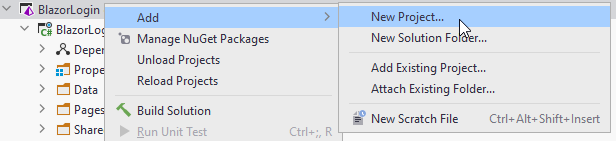

# New solution, new project

First, you need a solution. That could be an existing, or a new one.

Inside this solution, create a new Blazor-server project.

And then:

1) Select ASP.NET
2) Choose a name for the project
3) Select *Blazor Server App*
4) choose *no authentication*. This is where you alternatively could choose the Identity framework.
5) Create the project
