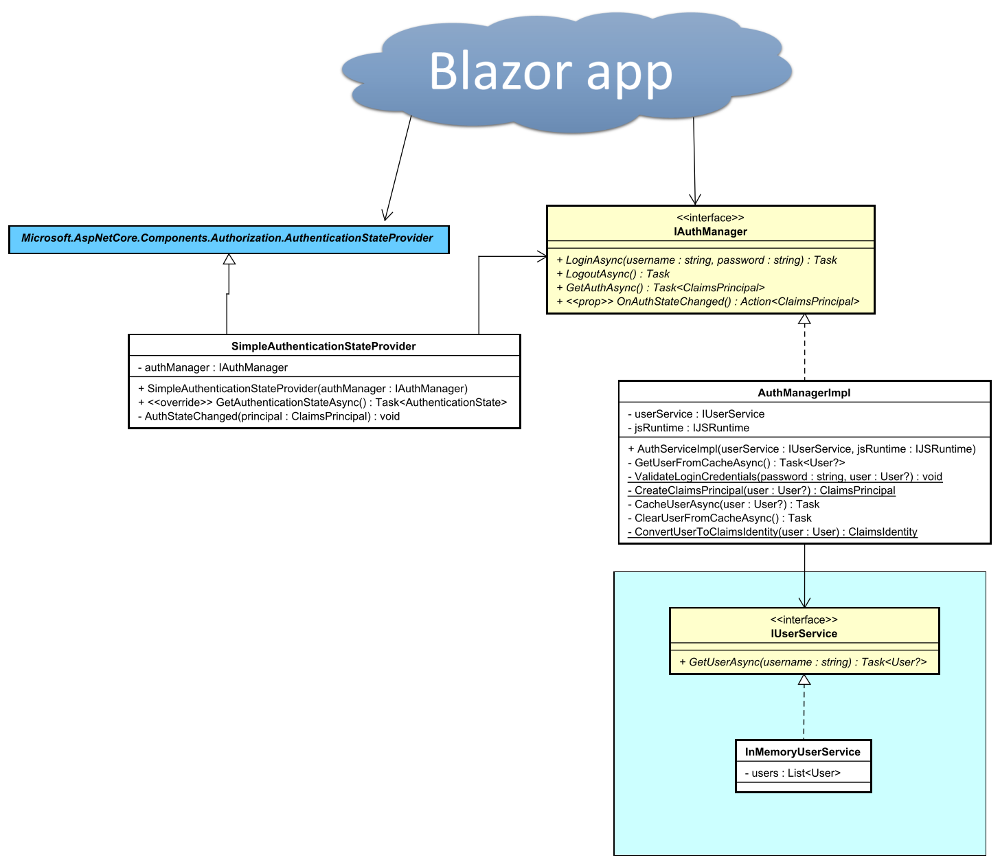

# New solution, new project

First, you need a solution. That could be an existing, or a new one.

Inside this solution, create a new Blazor-server project (or use an existing, in which case skip the below steps about creating a new project).

And then:

((1)) Select ASP.NET\
((2)) Choose a name for the project
((3)) Select *Blazor Server App*\
((4)) Choose *No authentication*. (This is where you alternatively could choose the Identity framework)\
((5)) Create the project

## Overview

The below diagram will give an overview of the classes we need.

 
The "Blazor app" represents your app. The blue, abstract class is from the authorization framework, already in Blazor.
It is used by the app to request information about who's logged in.

We need the `SimpleAuthenticationStateProvider` to provide that logged in information, whenever the Blazor app requests it. It overrides the method `GetAuthenticationStateAsync` from the super class.

The `IAuthManager` interface is used to handle logging in and out from your app, 
e.g. it is used by your log in component in your Blazor app.

The implementation, `AuthManagerImpl`  will manage retrieving the user from a service interface,
and cache that user in your browser, so that it can be provided to `SipmleAuthenticationStateProvider` whenever needed.

The `IUserService` is a data access interface, currently with just one method, which can retrieve a `User` object.
The InMemoryUserService is a dummy database, which just has a list of 3 hardcoded users. 
The interface and class in the blue box, i.e. `IUserService` and its implementation may later be moved to the client side.

The following slides will go through how to set up everything.