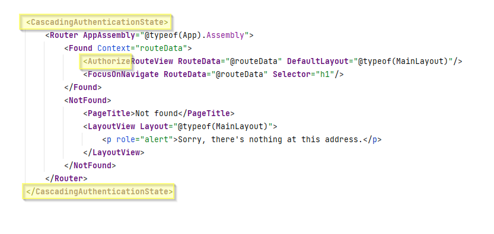

# Wrap the app in authentication
We must make available the authentication state to the entire app. 
We do this by wrapping the app in a `CascadingAuthenticationState` component.

Open the file app.razor, and modify it to the yellow highlighted, like so:

You update those three highlighted places.

Each page/component of your app can now request information about who is logged in, if any.