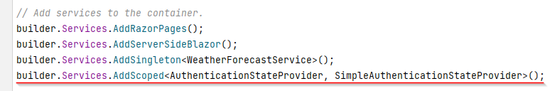

# AuthenticationStateProvider
This is an abstract class which exists in the Blazor framework. It is used to provide information about who is logged in, and what priviliges they have.

We must extend this class, and override the method which is called by Blazor to get the login/auth information.

Inside Authentication directory: create a new class, `SimpleAuthenticationStateProvider`, or whatever you want to call it.

It looks like this, code is explained below.

```csharp
using System.Security.Claims;
using Microsoft.AspNetCore.Components.Authorization;

namespace BlazorLoginApp.Authentication;

public class SimpleAuthenticationStateProvider : AuthenticationStateProvider
{
    private readonly IAuthManager authManager;

    public SimpleAuthenticationStateProvider(IAuthManager authManager)
    {
        this.authManager = authManager;
        authManager.OnAuthStateChanged += AuthStateChanged;
    }

    public override async Task<AuthenticationState> GetAuthenticationStateAsync()
    {
        ClaimsPrincipal principal = await authManager.GetAuthAsync();
        return await Task.FromResult(new AuthenticationState(principal));
    }

    private void AuthStateChanged(ClaimsPrincipal principal)
    {
        NotifyAuthenticationStateChanged(
            Task.FromResult(
                new AuthenticationState(principal)
            )
        );
    }
}
```

So, a few things to understand.

We get an instance of IAuthManager through the constructor, i.e. constructor dependency injection.
If we register an IAuthManager as a service in Program.cs, the framework will create an instance for us automatically.
We'll do this later.

The method `GetAuthenticationStateAsync()` is called by the framework whenever we have a page or component, which requires any kind of authorization. 
Maybe you are accessing a page that is secured by a requirement to be an *admin*. Blazor will ask the above class, if the current user should have access.  
Or maybe you have some parts of a page, which should only be shown, if someone is logged in. Then Blazor will ask this class, if anyone is logged in.

So, it's used a lot.

In the constructor, the second line, we subscribe to events from the IAuthManager, i.e. when you log in, an event will be fired. 
In that case, we want the SimpleAuthenticationStateProvider to notify the blazor app about a change to the current authentication state: The method `AuthStateChanged` is called upon such an event, and this method itself notifies the app about a change.

### Register the service
We need to register this class as a service, so the app can create it when needed.

Open Program.cs.

In here, add the following line:




