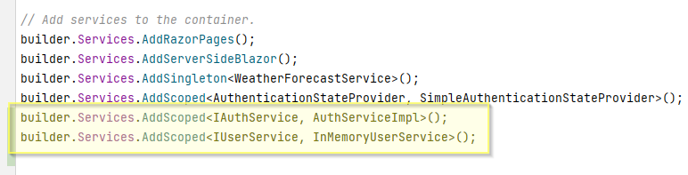

# Registering services
The last part of the setup is just to register the services, we have created. We already registered the `SimpleAuthenticationStateProvider`.

Again, open the Program.cs.

Add the following two services:

The setup is now complete.

The next step is to add some login functionality.