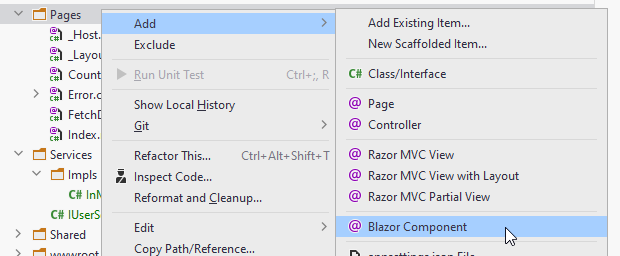

# Login page code

We need a page where we can log in.

Create a new Page:



### Code

At the top of the page, we need some directives:

```razor
@page "/Login"
@using BlazorLoginApp.Authentication
@inject IAuthManager authManager
@inject NavigationManager navMgr
```

We give the page a uri sub-path: "/Login", so we can navigate to this page.  
We inject an IAuthService, and a NavigationManager.

And then in the code block, the following:

```csharp
@code {
    private string userName;
    private string password;
    private string errorLabel;

    private async Task LoginAsync()
    {
        errorLabel = "";
        try
        {
            await authManager.LoginAsync(userName, password);
            navMgr.NavigateTo("/");
        }
        catch (Exception e)
        {
            errorLabel = $"Error: {e.Message}";
        }
    }
}
```

Here, fields for holding username, password, and any error messages.

And a method to be called, when we wish to log in. If any exceptions are thrown from `LoginAsync(...)`, e.g. upon failure in validation,
the exception is caught, and the errorLabel is updated with a message, so that the user is informed of any errors.

Upon successful login, we use the `NavigationManager` to change the page to the home page. If you open Index.razor, you will see the @page directive point to "/".

Next up the page-view.