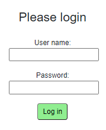

# Login page view
Next up, we will define the view of the login page.

### css
First, we need some styling. For this, we will create a style-behind.


Notice that in the right-click context menu, instead of new File, there is also new Stylesheet. Either works just fine.

When we name our css file the same as the razor file, and append `.css`, it will be a "style-behind", i.e. a css file only accessibly in this specific page/component.

Add the following to our style behind.
```css
.card {
    box-shadow: 0 4px 8px 0 rgba(0,0,0,0.2);
    transition: 0.3s;
    width: 250px;
    padding: 25px;
    text-align: center;
    margin: auto;
    margin-top: 50px;
}

.field {
    margin-top: 20px;
}

.loginbtn {
    background-color:lightgreen;
    border-radius: 5px;
    padding: 5px;
    padding-left: 10px;
    padding-right: 10px;
}

.loginbtn:hover{
    transform: scale(1.1);
    box-shadow: 0 2px 10px 2px #3f3f3f;
}
```

You may of course change the styling to your liking.

### html

Next up, the actual view:

```razor
<AuthorizeView>
    <NotAuthorized>
        <div class="card">
            <h3>Please login</h3>
            <div class="field">
                <label>User name:</label>
                <input type="text" @bind="userName"/>
            </div>
            <div class="field">
                <label style="text-align: center">Password:</label>
                <input type="password" @bind="password"/>
            </div>
            @if (!string.IsNullOrEmpty(errorLabel))
            {
                <div class="field">
                    <label style="color: red">
                        @errorLabel
                    </label>
                </div>
            }
            <div class="field">
                <button class="loginbtn" @onclick="LoginAsync">Log in</button>
            </div>
        </div>
    </NotAuthorized>
    <Authorized>
        <div class="card">
            <h3>Hello, @context.User.Identity.Name</h3>
        </div>
    </Authorized>
</AuthorizeView>
```

Notice how the outer tag is a `<AuthorizeView>` meaning inside this tag, we have access to check if a user is logged in or not.

Inside this tag, we have two others: `<NotAuthorized>` and `<Authorized>`.  
If no-one is logged in, the html inside `<NotAuthorized>` will be shown.  
If someone is logged in, the html inside `<Authorized>` will be shown.

In line 7 above, we define the user name input field, the type is "text", and we bind the value to the `userName` field variable.  
Similarly, in line 11, we have an input field of type "password", so that the inputted text is replaced with ***. Also here, we bind to a field variable.

In line 13, we have an `if-statement`, so that this `<div>` is only rendered, if there is actually something in the `errorLabel`.

Line 22 holds the button, with the `onclick` action that calls the method `LoginAsync`.

In line 28 you may notice an example of how to retrieve information about the logged in user. 
The `context` variable is available inside `<AuthorizedView>`-tags. The `User` accessed, is not *your* User class, 
it is the `ClaimsPrincipal.`

### UI

The login view will look like this:



Here, we can input username and password. Then click the log in button.

If any errors occur, e.g. no user found, or incorrect password, an error will be shown:


