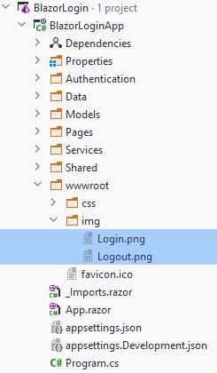
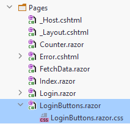

# Button component

We are going to add icons to the top bar to login and logout

### Icons

First, we need some icons.

I have uploaded a login and a logout icon to github, you can find them [here](https://github.com/TroelsMortensen/BlazorLogin/blob/master/BlazorLoginApp/wwwroot/img/Login.png)
and [here](https://github.com/TroelsMortensen/BlazorLogin/blob/master/BlazorLoginApp/wwwroot/img/Logout.png).

Just right-click the image and click "save image as", that should let you download the images.

These two images should be stored in a new "img" directory inside the "wwwroot" directory in your project:



Various resources can be put here.

### Component
Next up, we need to add a new blazor component in the pages directory. And a style behind:



### Styling
Copy the following into your style behind:

```css
.icon {
    width: 30px;
    cursor: pointer;
}
```

### The code
In your new component, we need a bit of code:

```csharp
@namespace Login
@using BlazorLoginApp.Authentication
@inject NavigationManager navMgr
@inject IAuthManager authManager

// view stuff here later..

@code {

    private void Login()
    {
        navMgr.NavigateTo("/Login");
    }

    private async Task Logout()
    {
        await authManager.LogoutAsync();
        navMgr.NavigateTo("/");
    }

}
```

Notice there is no page directive for this component, i.e. we cannot navigate to it, only use it in other components/pages.

First is declared a "@namespace Login", this is needed because this component will be used from something outside of the Pages folder. In those cases we need to define namespaces.

Then we inject the `NavigationManager` and `IAuthManager`.

In the code block, we just have two methods.\
`Login()` will navigate to the login page.\
`Logout()` will use the `authManager` to clear the login status, and the navigate to the home page.

### The view
The view part is equally simple:

```razor
<AuthorizeView>
    <Authorized>
        
    </Authorized>
    <NotAuthorized>
        
    </NotAuthorized>
</AuthorizeView>
```

Again, everything is wrapped in `<AuthorizeView` so that we can show different things based on whether the user is logged in or not.

If there is an authorized user, the image of Logout.png is shown, otherwise the Login.png. There is also an onclick handler on both.

### Adding to top bar
Open the MainLayout.razor, and add the new component. 
Notice we import the Login namespace. And the `<LoginButtons>` component is added as well.

```razor{2,13}
@inherits LayoutComponentBase
@using Login

<PageTitle>BlazorServerUI</PageTitle>

<div class="page">
    <div class="sidebar">
        <NavMenu/>
    </div>

    <main>
        <div class="top-row px-4">
            <LoginButtons/>
            <a href="https://docs.microsoft.com/aspnet/" target="_blank">About</a>
        </div>

        <article class="content px-4">
            @Body
        </article>
    </main>
</div>
```

Now, in the top bar, next to the "About", you should see the login icon.

That should be all. The last slide is about how secure this system is. Or isn't.