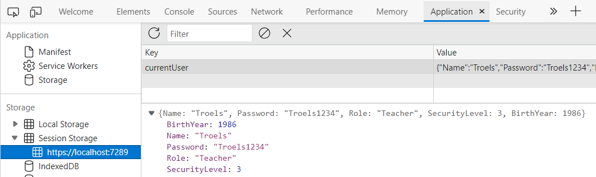

# Security

This login system is a toy system. It is meant to show how to play around with the authorization of a blazor app. However, it is not particularly secure.

After you log in, you can right-click to inspect the page (1), then you can open the Application tab (2), you may need to click (3) to find it.


In the Application tab, you can see the user as json, we stored in the session storage:



This data can also easily be modified, meaning I could change my Role to be something else, or raise my security level.  
After a page refresh, the blazor authorization would retrieve this updated user instead.

A malicious user might also change the user-name in the cached user, and so, they would be logged in as someone else.

We will not go into details on how to fix this.\
However, whenever the user is retrieved from session storage, your program would have to fetch that user from the database (or wherever), and compare username and password of cached user to the database user.\
If those two do not match, log the user out, or throw an exception.

Implementation is left to the reader.

### Last minor optimization
As mentioned earlier, we could also store the ClaimsPrincipal to improve efficiency, something like this:
```csharp
public async Task<ClaimsPrincipal> GetAuthAsync()
{
    if (principal != null)
    {
        return principal;
    }

    string userAsJson = await jsRuntime.
                InvokeAsync<string>("sessionStorage.getItem", "currentUser");
    
    if (string.IsNullOrEmpty(userAsJson))
    {
        return new ClaimsPrincipal(new ClaimsIdentity());
    }
    
    User? user = JsonSerializer.Deserialize<User>(userAsJson);
    
    principal = CreateClaimsPrincipal(user);
    return principal;
}
```
This would need a field variable for the principal, and we need to **set it** when logging in and **clear it** when logging out (assign `null`).

It will become `null` when refreshing the page, in which case the user in session storage would be fetched.