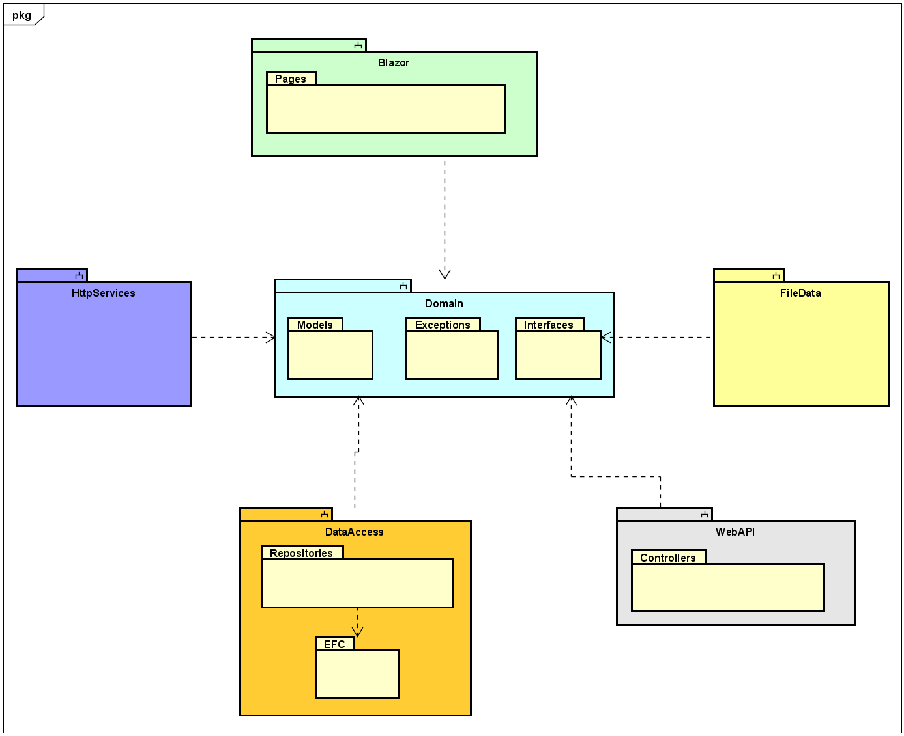

# Project structure
You have previously heard about layered systems on second semester, a simple example could look like this:

The above would be a basic structure for a local desktop app, e.g. SEP1, roughly sketched.  
In SEP2 you expanded to a client/server system, using JFX. Such a system could be illustrated in a layared diagram like below:

The same approach applies: Layers have different responsibilites, and each layer is separated by interfaces. In SEP2 you probably divided layers into different packages.
The next step is to separate into *components*. 
I will steal the following explanation from Robert C. Martin's book "Clean Architecture":

> Components are unit of deployment. They are the smallets entities  that can be deployed as part of a system. In Java, they are jar files. In .NET they are DDLs.
> 

In Java, components are often organized in modules. In .NET, components can be organized into various *projects*. 
Components can be considered a bit like lego-building blocks, with the intention that you used these blocks til construct the system. They provide modularity, so building-blocks can easily be swapped out.

This means your .NET app could be structured using an approach like below, roughly sketched. 
Notice that some "packages" have a little upside-down two-pronged fork above the name. 
This indicates a "sub-system" in Astah, and we use it to represent components/projects/modules. Inside each, you can have packages. Inside packages, you find interfaces, classes, and the like.

This could be an example of your entire solution, at the end of the semester. You will probably have these 6 components: 
1) Blazor - The UI. It will depend on interfaces in the Domain
2) Domain - Holds domain model classes, and certain central interfaces. Potentially custom exceptions, but probably not in our case
3) FileData - Implements interface from Domain. Will provide functionality to store data in a file 
4) HttpServices - Will contain client classes, which can contact a server 
5) WebAPI - This is the server
6) DataAccess - Similar to FileData, but data will be stored in a database

The first tutorial will cover 1, 2, and 3. We will then expand later with 4 and 5. Then lastly 6.

In this first part we will start with Blazor, Domain and FileData. You may notice there is no component for business logic, simply because this app is rather simple. We are also going to put most interfaces into the Domain.Interfaces. This is also a simplified approach. 

In your SEP3 you're going to need a component for logic. Sometimes this component is called Application. 

The point is that these projects (components) are separated, each handling their own responsibilities. It will feel like overkill in this tutorial, because each component will be pretty small, containing only a handful of classes. But this is just practice. 

There are different approaches on how to structure these components. We will do "by layer", because that is simpler. However, in your professional career, you will probably encounter a separation "by feature". This is an often recommended approach, however much more complicated.
Basically, if you want to try it out for SEP3: Each new user story, you implement, will go into a new component.

This may seem a bit overwhelming, but we will take it step by step, holding hands along the way. You will be safe. No worries.

