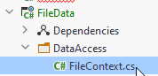

# FileContext

We will now create the class, which can save and retrieve data. 
We will be serializing objects to JSON, and write to a file. It's a pretty simple substitute for a database.

Inside the FileData component: Create a new directory, DataAccess.

Inside this directory, create a new class, call it FileContext:



Below, the content of the FileContext will be explained.
The final version of the class can be found [here](https://github.com/TroelsMortensen/BlazorTodoApp/blob/Part1/FileData/DataAccess/FileContext.cs)

### Fields
You need to define the file, which should hold the data. And we need a collection of Todo objects, along with a property to get the todos:

```csharp
private string todoFilePath = "todos.json";

private ICollection<Todo> todos;

public ICollection<Todo> Todos
{
    get
    {
        if (todos == null)
        {
            LoadData();
        }

        return todos;
    }
}
```
We use a collection, because this class should not have get-methods to access objects at an index. This is to simulate how you will work with a database in the future.

We use lazy instantiation of the `todos` collection. This will be clear, whenever any changes are saved. This is also to simulate how you will work with the database in the future.

### Constructor
Then we need a constructor. We wish to insert some dummy data into the file, if nothing exists, just so we have
something to work with. The constructor looks like this:

```csharp
public FileContext()
{
    if (!File.Exists(todoFilePath))
    {
        Seed();
    }
}
```

What's going on?

Lines:  
3 Here we check if there is already a file at the given path.  
5 If there's no file, we call the `Seed()`method. This will be implemented shortly. Its purpose is to insert dummy data.
7 We load the data from the file into the collection. 

We now need the `Seed()` method. It looks like this:

```csharp
private void Seed()
{
    Todo[] ts = {
        new Todo(1, "Dishes") {
            Id = 1,
        },
        new Todo(1, "Walk the dog") {
            Id = 1,
        },
        new Todo(2, "Do DNP homework") {
            Id = 3,
        },
        new Todo(3, "Eat breakfast") {
            Id = 4,
        },
        new Todo(4, "Mow lawn") {
            Id = 5,
        },
    };
    todos = ts.ToList();
    SaveChanges();
}
```
In the above method an array of Todos are created. Notice here, we manually set the Id of each todo. We only do this for this specific dummy data.
In the end the array is stored in the `todos` field. And then we call a currently-non-existing method, `SaveChanges`.

### Save changes
The purpose of this method is to take the content of the `Todos` field, and put into the file.
```csharp
public void SaveChanges()
{
    string serialize = JsonSerializer.Serialize(Todos);
    File.WriteAllText(todoFilePath,serialize);
    todos = null;
}
```

Later, when we work with databases through Entity Framework Core, you will also need to call SaveChanges after interacting with the database. So, we practice the workflow here.

### Load data
We need a method to read from the file, so we can retrieve data.
```csharp
private void LoadData()
{
    string content = File.ReadAllText(todoFilePath);
    Todos = JsonSerializer.Deserialize<List<Todo>>(content);
}
```
What's going on here?

The method is private, because this class should be responsible for determining when to load data.  
We read all the content of the file, it returns a string.  
Then that string is deserialized into a `List<Todo>`, and assigned to the field variable. `ICollection` is an interface of `List`, so we can make this assignment.

### Accessing data
Finally, we need a way to actually get the data. But, we already have that in our property. 
This is, again, to simulate the way you'll interact with the database in the future.

The next step will be to add a Data Access Object with the usual [CRUD](https://en.wikipedia.org/wiki/Create,_read,_update_and_delete) operations.

The final version of the FileContext can be found [here](https://github.com/TroelsMortensen/BlazorTodoApp/blob/Part1/FileData/DataAccess/FileContext.cs)