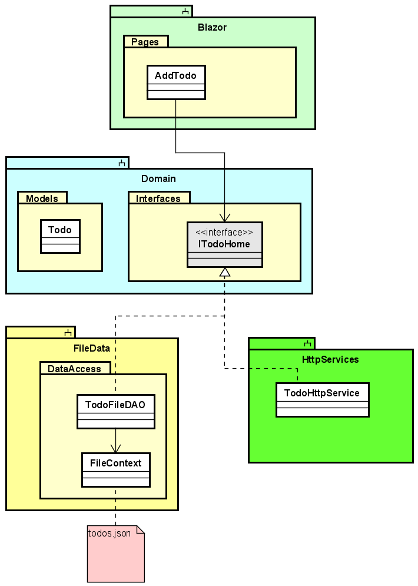

# Data access interfaces
As mentioned previously, our Blazor app will initially get data from the just created FileContext. 
Later we wish to change this, so the data comes from a server. 
I.e. we wish to swap out the implementation of these interfaces. 

In order to not have to change the dependencies of the Blazor component, we put the interfaces in the Domain component.
It will eventually look something like this:



We currently have the Blazor, Domain, and FileData components. In a later tutorial, we will expand with the HttpServices component. At that point, we wish to swap out which implementation the Blazor component uses.

Because we have applied the dependency inversion principle, 
it should be little work to swap from using file storage, 
to using a client to get data from a server.

But first, we need to define the interface.


### ITodoHome
Inside the Domain component, create a new directory. I have called mine "Contracts". "Interfaces" imply the same thing. 
But interfaces are essentially a contract between two classes: Class A, which needs some functionality, and Class B which provides some functionality. 
The interface is then a Contract, so class B knows what functionality to deliver, and Class A knows what functionality it will get. 

Inside the Contracts directory, create a new interface, ITodoHome. I have used *Home here, other choices could have been DAO, Service, Repository, Manager, etc. Pick either one.

```csharp
using System.Collections.Generic;
using System.Threading.Tasks;

namespace Blazor.Services;

public interface ITodoHome
{
    public Task<ICollection<Todo>> GetAsync();
    public Task<Todo> GetById(int id);
    public Task<Todo> AddAsync(Todo todo);
    public Task DeleteAsync(int id);
    public Task UpdateAsync(Todo todo);
}
```

We are using asynchronous programming, so all methods returns a Task, and method names are suffixed 'Async'.

We have here the standard CRUD operations. Notice how the `AddAsync` method returns a Todo object. This is because the Todo object is finalized when storing it, i.e. it gets an Id assigned from the FileData component, at some later point. We return it, so the finalized object can be displayed to the user, should we want to.

Next up, we need the adapters to let the Blazor app get data from the FileContext. These are our Data Access Objects.