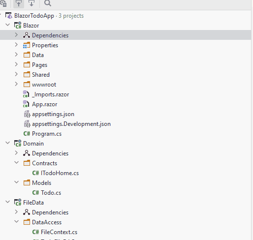
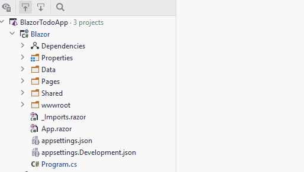

# Adding services
Now that we have our data persistence in place, we are ready to start working on the Blazor side of things. 

### Managing component dependencies
The first step is to make sure that our Blazor app knows about our ITodoHome, and TodoFileDAO so that we can use it to persist data.

Now, in the `Program.cs` class of the Blazor component, we can register services, so that the framework can create these as needed, and inject into whatever class needs a given service. This is the dependency injection, the Blazor framework can handle this automatically for us. That's pretty nifty. It makes it easier to retain loose coupling.

We encounter a problem here. In order to register a service of type FileContext and TodoFileDAO, the Blazor component must know about the FileData component.

This is the minor hiccup, I mentioned earlier. In order to reference classes from FileData, Blazor must know about FileData. 
We would have liked to avoid this knowledge, but it is only the `Program.cs` class which will be "tainted" like this, and that's okay.

We need a dependency from Blazor to FileData:




### Adding the services
Then, in `Program.cs` we need to add services. It goes like this:



Now, whenever a page request a class, which has been added as a service, the framework will create that for us. 
If we request a class, which hasn't been added, the framework will give an error, saying it was unable to create the requested service.

Notice we use `AddScoped`, this is a good default approach. Adding a singleton can sometimes cause problems, if you are not careful.

With the line 

```
builder.Services.AddScoped<ITodoHome, TodoFileDAO>();
``` 

we are saying, that whenever the blazor app requests an instance of `ITodoHome`, it will get a `TodoFileDAO`. In the future, when we wish to provide a different implementation, we just need to change this single line of code, and our entire app will get data from a server somewhere, instead of a file. 

### Multithreading problem?
In our case here, we could potentially have two clients, who wishes to create Todo items at the same time, 
cause two different instances of FileContext to attempt to write to the same file. That will cause an error.  
We could use a singleton and synchronize the FileContext class to make it thread safe, 
but that's out of scope of this exercise, given that the FileContext is just temporary.
