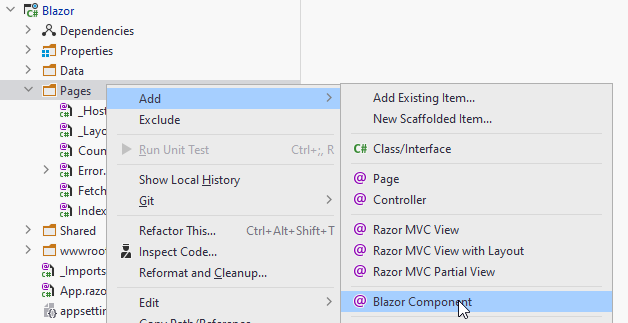

# Viewing todo items
We are now ready for our first UI element. We need a page, where we can view existing Todo items. Select *Blazor Component*, not the *Page*!



This will open a new dialogue, where you can type in the name (e.g. *Todos*) of the new page, and pick either Component or Page. 
Select *Page*. It doesn't make much of a different, except when selecting Page, the page directive is added at the top: `@page "/Todos"`.
This means we can navigate to this page with a URI.

You should get an empty page like this:
```razor
@page "/Todos"
<h3>Todos</h3>

@code {
    
}
```

This is your new Todos overview page. Not much functionality yet.

**Line 1** is the page directive, as mentioned above. You could run the app, and type in "/Todos" at the end of the URI. That should open this page.

**Lines 2-3** is the view part, here you will define the html to setup what the view should look like. We will spice it up with razor syntax, which is embedded C# code. This is used to generate parts of the page. We will get back to this. In MVVM terms, this is the *view*.

**Lines 4-6** is your **code block**. This is your *view-model*, essentially. Here you put fields to manage the state of the view, e.g. what is enabled, visible, shown. It's also here, in fields, we hold the data to be shown.

We don't have the model, which you are used to from SDJ2, but in Blazor you can basically consider it to be any type of service-interface, your code block uses. That will in a short while be the ITodoHome interface.

