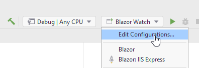

# dotnet watch run (optional step)
So far, whenever you have made a change to your blazor app, you need to stop the app, and start it again, for the changes to take effect.

**If you are fine with this, you can just skip this step.**

However, there is another approach, which might increase your workflow speed. It's the watch command, which will automatically update a running blazor app, whenever changes are made.
This just means that in most cases, you don't have to restart your app to see changes. 
Whenever you save a file, the running blazor app will update. 
In theory, at least, sometimes you will be asked to restart the app.


### Watch
I recommend just using the first approach. However, for the SEP project, maybe approach 2 below is better.

At the bottom in Rider, there is a tab called Terminal:


When you open this tab, you probably start at your current solution folder, at the time of writing, mine is

C:\TRMO\RiderProjects\BlazorTodoApp

You must enter the Blazor project folder, with the `cd` command, and in here, you can type `dotnet watch run`. This will run your app with the watch, i.e. auto-update, enabled:

```terminal
PS C:\TRMO\RiderProjects\BlazorTodoApp> cd .\Blazor\
PS C:\TRMO\RiderProjects\BlazorTodoApp\Blazor> dotnet watch
```

When you want to close the app again, you need to click somewhere in the terminal tab and press <kbd>ctrl</kbd> + <kbd>c</kbd> a couple of times.

Sometimes the terminal will also ask you, if you wish to restart the app. Click somewhere in the terminal and press <kbd>y</kbd>. 
This usually happens if you change methods headers. 

Sometimes style sheet class are not updated correctly either, which will require a manual restart.

### Approach 2
This approach requires a bit 
You can also setup a launch configuration, so you can use the little green play button up to the top right of Rider. 

Click the drop down, and click the *Edit Configurations...*:



This opens a dialog. Click the top left plus to add a new configuration, select *Native Executable*


Then go through the below steps:


1) Give it a name, e.g. Blazor Watch.
2) Locate your dotnet.exe, this program is run when you type `dotnet` in the terminal or command window. In Windows the default path is as the screenshot.
3) Add program arguments
4) Locate the folder where your .csproj file for the Blazor project is. I.e. inside the solution, inside the Blazor project folder.
5) Click OK.

Now you have a new launch configuration from the drop down, you can run. This time with the *watch* enabled.

### Note:
This *watch* is still under development, and you may still sometimes have to restart your app.