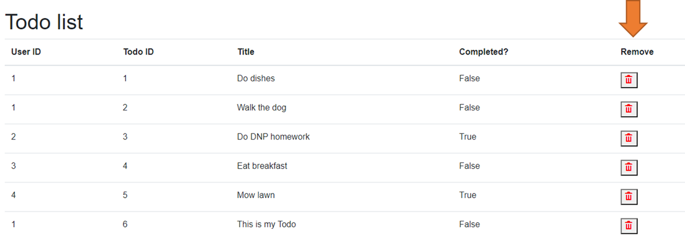

# Removing a Todo

Next up, we want to be able to delete a Todo. You have a todo about doing the dishes, but don't want to? Just delete it.

For this part, we will modify the existing `Todos.razor` file, so, moving forward, the solution will proceed on a new branch:

[Part 2](https://github.com/TroelsMortensen/BlazorTodoApp/tree/Part2)

### First, the goal

The goal is to add an extra column to the table view of the Todos overview. This column will contain a delete button, which will delete the Todo of that row.

The result will look something like this:



### Code block

We will start by adding a method in the code block of `Todos.razor`, which can delete a Todo item. It looks like this:

```csharp
private async Task RemoveTodo(int id)
{
    errorLabel = "";
    try
    {
        Todo todoToRemove = todos.First(todo => todo.Id == id);
        await TodoHome.DeleteAsync(id);
        todos.Remove(todoToRemove);
    }
    catch (Exception e)
    {
        errorLabel = e.Message;
    }
}
```

Let us go over the method.\
First, in line 3 we have a `string errorLabel`, that means you must also add this as a field variable.
It is, as always, used to provide a message to the user, if something goes wrong. That is also the reason of the try-catch.

Line 6 uses the `First()` method to find the first `Todo` in the `todos` collection, which matches the given `id`.
In line 7 we make an asynchronous call to the `TodoHome` to delete by id. This call is `await`ed.
Finally, in line 8, we also remove the relevant `Todo` from the `todos` collection, i.e. the collection displayed in the table.\
An alternative approach would be to re-fetch all the todos through the `TodoHome`.

### The view

Next up, we need to add that new column with the delete button to the table.\
Update the relevant part of the view like this:

```razor{3}
else
{
    <table class="table">
        <thead>
        <tr>
            <th>Owner ID</th>
            <th>Todo ID</th>
            <th>Title</th>
            <th>Completed?</th>
            <th>Remove</th>
        </tr>
        </thead>
        <tbody>
        @foreach (var item in todos)
        {
            <tr>
                <td>@item.OwnerId</td> 
                <td>@item.Id</td> 
                <td>@item.Title</td> 
                <td>@item.IsCompleted</td>
                <td>
                    <label 
                    @onclick="@(() => RemoveTodo(item.Id))" 
                    style="cursor:pointer; color: red; font-weight: bold">
                        &#x2717;
                    </label>
                </td>
            </tr>
        }
        </tbody>
    </table>
}
@if (!string.IsNullOrEmpty(errorLabel))
{
    <label style="color: red">@errorLabel</label>
}
```


