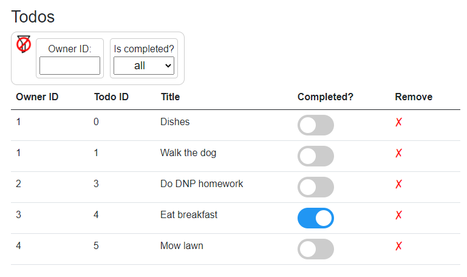

# Filtering todos

We would like to be able to filter the table view based on `OwnerId`. 
This requires more changes to `Todos.razor` and a new GitHub branch for this feature, 
and the resulting file is found [here](https://github.com/TroelsMortensen/BlazorTodoApp/blob/4Filtering/Blazor/Pages/Todos.razor).

The result will look like this:



We will first update the code, then the view, then apply styling at the end.

### Code
We need to make a few changes to the code, in various places. There are two approaches to this, we will take the simple approach, and the "better" is left to the reader to solve, described later.

###### Fields

First, we need to keep track of _all todos_ and we need to keep track of which _todos to currently display_, based on the applied filters.\
We also need to fields to hold filtering information, and a field which determines whether the filters are shown or not.

```csharp
private ICollection<Todo> allTodos, todosToShow;
private string errorLabel;

private int? ownerIdFilter;
private bool? isCompletedFilter;
private bool doShowFilters;
```
First, the two collections: All the todos, and the todos to be shown.\
We still have the `errorLabel`.\
Then a field of type `int?`, where the "?" means that this `int` can be `null`. 
This is relevant, because we need a value to indicate that this filter should not be applied, i.e. when the filter-value is `null`.\
Similarly, the next field is of type `bool?`, meaning the `isCompletedFilter` can have the following values: `null`, `true`, or `false`.\
Finally, a bool to indicate whether the filters should be shown or not.

###### Two lists

Initially the `allTodos` and `todosToShow` will be the same. 
That happens in the method `OnInitializedAsync()`, the method which is called when this page is loaded:

```csharp
protected override async Task OnInitializedAsync()
{
    allTodos = await TodoHome.GetAsync();
    todosToShow = allTodos;
}
```

###### Show/hide filters

The filters will not initially be shown. We will introduce a button to show the filters or hide them. 
That button must call the following method:

```csharp
private void OpenCloseFilters()
{
    doShowFilters = !doShowFilters;
    if (!doShowFilters)
    {
        ownerIdFilter = null;
        isCompletedFilter = null;
        todosToShow = allTodos;
    }
}
```

Whether the filters are shown or not is determined by the bool field variable `doShowFilters`. 
This method is used to toggle visibility, which is done by flipping the boolean value, in **line 3**.

When the filters are hidden again, we want to remove any filtering. That's done inside the `if`-statement.

###### Owner ID filter
Whenever a value is input/changed in the Owner ID filter field, we want to update the shown todos. 
We do that by calling the following method upon input-field change:

```csharp
private void UpdateOwnerFilter(ChangeEventArgs args)
{
    string value = (string)args.Value;
    if (string.IsNullOrEmpty(value))
    {
        ownerIdFilter = null;
        ApplyFilters();
        return;
    }
    int idFilter = int.Parse(value);
    if (idFilter < 0)
    {
        return;
    }
    
    ownerIdFilter = idFilter;
    ApplyFilters();
}
```
The `arg` argument contains the new value of the input-field, an `int`, but represented as a `string`.\
So, if the value is `null` or empty, then we don't apply the "Owner ID" filter.\
If there is a value, we parse it to an int. Owner IDs cannot be less than 0. We upddate the `ownerIdFilter` value, and call a yet-to-be-written method `ApplyFilters`.

###### Is completed filter
The following method will be called, whenever the value in the drop-down changes, i.e. to indicate whether to filter by completed status or not.

```csharp
private void UpdateCompletedStatusFilter(ChangeEventArgs args)
{
    string value = (string)args.Value;

    try
    {
        isCompletedFilter = bool.Parse(value);
    }
    catch (Exception e)
    {
        isCompletedFilter = null;
    }
    ApplyFilters();
}
```
Again, the value provided by the change event is a string. We try to parse that string to a bool.
If that succeeds, `isCompletedFilter` is either `true` or `false`. 
If it doesn't succeed, because the value is `""` or `null`, then an exception is thrown, an caught, and `isCompletedFilter` is set to `null`, indicating that specific filter should be ignored.\
Again, the `ApplyFilters` are shown. That method is described below.

###### Apply the filters
The below method is called whenever we want to apply our filters. This is a decent and scalable approach to apply many more filters in the future.

```csharp
private void ApplyFilters()
{
    todosToShow = allTodos;
    if (isCompletedFilter != null)
    {
        todosToShow = todosToShow.
                            Where(todo => todo.IsCompleted == isCompletedFilter).
                            ToList();
    }
    if (ownerIdFilter != null)
    {
        todosToShow = todosToShow.
                            Where(todo => todo.OwnerId == ownerIdFilter).
                            ToList();
    }
}
```
Initially, we start with all the todos in a list.\
If the user wants to filter by completed status, then `isCompletedFilter` is not `null`, and in line 6 we use the following piece of code
```csharp
todosToShow.Where(todo => todo.IsCompleted == isCompletedFilter)
```
This means: from `todosToShow` pick all todos which matches the predicate argument, i.e. `todo.IsCompleted == isCompletedFilter`. We then call `ToList()` to return the result as a new list.

This is a bit similar to a `SELECT` statement from SQL.

We do the same, just for the Owner ID filter.

So, for each filter, we whittle down the initial list more and more. With this approach, you can easily introduce more filters, and they will all work together.

This was all the changes to the code block. You may just want to compare to [my solution](https://github.com/TroelsMortensen/BlazorTodoApp/blob/4Filtering/Blazor/Pages/Todos.razor).

### View
Now the view, the change goes between the header `<h3>` and the stuff about displaying the todos:


###### Icons
In my example I use two icons:


You can either find your own or download mine. The _existing_ "wwwroot" folder in your project is the folder for all resources. 
Create a new folder inside, called "img". Put the two funnel icons in the "img" folder. 

You can find the two icons [here](https://github.com/TroelsMortensen/BlazorTodoApp/blob/4Filtering/Blazor/wwwroot/img/funnel.png) and [here](https://github.com/TroelsMortensen/BlazorTodoApp/blob/4Filtering/Blazor/wwwroot/img/clear_funnel.png).

###### html

We need the following piece of html and razor syntax, placed as explained above:

```razor
<div class="filterbar">
    <div class="filterscontainer">
        
        
        @if (doShowFilters)
        {
            <div class="filter">
                <div>
                    <label>Owner ID:</label>
                </div>
                <div>
                    <input type="number" 
                    class="owneridfield" 
                    @oninput="args => UpdateOwnerFilter(args)" 
                    min="0"/>
                </div>
            </div>
            <div class="filter">
                <div>
                    <label style="text-align: center">Is completed?</label>
                </div>
                <div>
                    <select class="completedstatusfield" 
                    @onchange="args => UpdateCompletedStatusFilter(args)">
                        <option value="all">all</option>
                        <option value="true">true</option>
                        <option value="false">false</option>
                    </select>
                </div>
            </div>
        }
    </div>
</div>
```

There is a bit to unpack. First, a bunch of `<div>`s all over the place to organize things.

**Line 3-5** This is the funnel icon which, when clicked, will either show or hide the filter options.
It is a `` tag. In **line 3** the source is defined, but in a strange way:
```razor
src="img/@(doShowFilters?"clear_" : "")funnel.png"
```
We have mixed razor syntax in here, with the @(...) part. It is a ternary expression on the format:
```
<condition> ? <option a> : <option b>
```
It will evaluate the condition, in this case `doShowFilters`. If the condition is true, the string "clear_" is inserted. If the value is false, nothing is inserted.\
The result is that the src can be either:
> clear_funnel.png

or

> funnel_png

based on the value of `doShowFilters`.

**Line 5** is the on-click action, i.e. when this img is clicked, call the method `OpenCloseFilters`, which was described above.

Then an if-statement in **line 7**. So, if `doShowFilters` is true, then the html inside the if-statement is rendered.

The divs with class "filter" is a box containing a filter-name and an input. First the number-input, then the drop-down.

**Lines 14-17** is the number input field. There's a css class. And an "oninput" action, which is fired whenever the content of the field changes. 
I.e. it is different from the "onchange" action, which fires when the input field loses focus, or enter is pressed.\
The lambda expression calls the `UpdateOwnerFilter` method.\
**Line 17** says the minimum value of the input is "0".

**Lines 24-29** defines the drop-down menu, with the options of "all", "true", or "false".\
Also here an "onchange" action, to call `UpdateCompletedStatusFilter()` method, when the user selects an option.

### Style
Finally, the styling, to organize things.

Put the following in the style-behind:

```css
/* filters */
.filterbar {
    border: 1px solid #ccc;
    border-radius: 10px;
    padding: 5px;
    display: inline-block;
    
}

.filterscontainer{
    display: flex;
}

.filter {
    border: 1px solid #ccc;
    border-radius: 5px;
    padding: 5px;
    margin: 5px;
    text-align: center;
}

.completedstatusfield {
    width: 100px;
    text-align: center;
    font-size: large;
    height: 30px;
}

.owneridfield {
    width: 100px;
    text-align: center;
}

.funnel{
    width:30px; 
    height:30px;
    cursor: pointer;
}
```

We will not get into details about this.

### Test
That should be all the setup required.

Now, test the following, by running the app and opening the todos page.

1) Click the funnel icon, and notice it changes between the two icons. It also shows/hides the filterings.
2) Insert an owner id number, and notice how the displayed todos update, each time you type in a new value.
3) Use the arrows to the right side of the input field to increment and decrement the value, and notice the todos change.
4) Verify you cannot insert a number less than 0, or use the arrows to scroll below 0. I notice -3 is insertable, but no event seems to be fired.
5) Clear the Owner Id field
6) Make sure you have both completed and uncompleted todos.
7) Use the Is completed filter, and notice the changes.
8) Make sure you have a user with at least 3 todo items. You may need to make new.
9) Play around with applying both filters at the same time.
