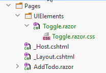

# Components

So far, we have mostly worked with pages, but not really utilized components. It may take some practice to get used to
use components, but they are very powerful for re-usability.

The smallest UI elements can be made into components. Take the toggle button, we use to set a Todo as completed:


These are essentially checkboxes, just with a bunch of styling applied to make them look nicer (or at least different).

If we wanted to use these again in a different place of the app, your initial thought might be to just copy the code:

```razor
<label class="switch">
    <input  type="checkbox" 
            checked=@item.IsCompleted 
            @onchange="@((arg) => ToggleStatus((bool)arg.Value, item))">
    <span class="slider round"></span>
</label>
```

But if you want a uniform look on your app, you will have to update multiple places, if the look of the toggle button changes.

Let's try and extract a ToggleComponent as an example.

Code is found in [this branch]()

### Toggle Component

First, we need some organization. Currently all pages are just in the pages directory, but that can eventually get messy.

Create a new directory in Pages, called UIElements.

Inside here create a new blazor component (it's just a page without the @page directive at the top), call it Toggle.razor.
We will also need a style-behind.



### Styling

Let's start with the styling. The current toggle in Todos.razor has some classes, located in the `Todos.razor.css`, we can just copy those, and so your `Toggle.razor.css` looks like this:

```css
.switch {
    position: relative;
    display: inline-block;
    width: 60px;
    height: 34px;
}

.switch input {
    opacity: 0;
    width: 0;
    height: 0;
}

.slider {
    position: absolute;
    cursor: pointer;
    top: 0;
    left: 0;
    right: 0;
    bottom: 0;
    background-color: #ccc;
    -webkit-transition: .4s;
    transition: .4s;
}

.slider:before {
    position: absolute;
    content: "";
    height: 26px;
    width: 26px;
    left: 4px;
    bottom: 4px;
    background-color: white;
    -webkit-transition: .4s;
    transition: .4s;
}

input:checked + .slider {
    background-color: #2196F3;
}

input:focus + .slider {
    /*box-shadow: 0 0 1px #2196F3;*/
}

input:checked + .slider:before {
    -webkit-transform: translateX(26px);
    -ms-transform: translateX(26px);
    transform: translateX(26px);
}

/* Rounded sliders */
.slider.round {
    border-radius: 34px;
}

.slider.round:before {
    border-radius: 50%;
}
```

You may not need everything, but I just copied an example from w3 schools, and am not entirely sure what's going on.

You can now delete the same styling from Todos.razor.css.

### The component

The component is fairly simple, the entire class looks like this:

```razor
@namespace UIElements

<label class="switch">
    <input  type="checkbox" 
            checked=@IsCompleted 
            @onchange="@((arg) => Callback.InvokeAsync((bool)arg.Value))">
    <span class="slider round"></span>
</label>

@code {
    [Parameter]
    public EventCallback<bool> Callback { get; set; }

    [Parameter]
    public bool IsCompleted { get; set; }
}
```

**Line 1:** Whenever blazor components are split across different directories, we need to use namespaces. 
Here we have defined that the Toggle-component is located in UIElements namespace. Other components who wants to use the Toggle must then have a `@using UIElements`.

**Lines 3-8:** This was mainly stolen from the Todos.razor. With a few minor changes. Notice the `<input>` element is split across multiple lines for readability.

**Line 4:** We define the `<input>` as a checkbox.
**Line 5:** We say the checked-status, i.e. checked or un-checked, is read from the property `IsCompleted`, in the code block.
**Line 6:** We define the method to be called (lambda expression) when the value of the checkbox changes, i.e. from checked to un-checked or vice versa.\
What we do, is call a type of delegate, the Callback with the value of the checkbox. It is sort of like an observer pattern. Other components can subscribe to this event, and get the boolean value.
This is a _very_ common approach to component-communication.\
We have previously seen the page directive argument, which is another way of component-communication.

In the code block we have two properties, marked as `[Parameter]`, meaning this value can be set from the outside.

The `EventCallback<bool>` is a delegate, meaning methods/lambda expressions can be added to it, and when the Callback is invoked, all added methods are called.

The bool is just for the checked/un-checked value of the checkbox.

### Usage
Now that we have the component, how is it used?

In Todos.razor we must make changes.

First, at the top, we must declare a using statement to get access to UIElements:

```razor{4}
@page "/Todos"
@using Domain.Models
@using Domain.Contracts
@using UIElements
@inject ITodoHome TodoHome
@inject NavigationManager navMgr
```

Next, we modify the table:
```razor{7-9}
@foreach (var item in todosToShow)
{
    <tr>
        <td>@item.OwnerId</td>
        <td>@item.Id</td>
        <td>@item.Title</td>
        <td>
            <Toggle IsCompleted="@item.IsCompleted" Callback="@(b => ToggleStatus(b, item))"/>
        </td>
        <td>
             Edit(item.Id))"/>
        </td>
        <td>
            <label @onclick="@(() => RemoveTodo(item.Id))" 
                style="cursor:pointer; color: red; font-weight: bold">
                &#x2717;
            </label>
        </td>
    </tr>
}
```

Notice lines 7-9 previously contained the html/code for the toggle. 
Now it is just a reference to our Toggle component. We pass to arguments, you can compare this to constructor arguments.

The Toggle asked for a bool, which we give it through `IsCompleted="@item.IsCompleted"`.
It also asked for a method for the Callback, and here we give it a lambda expression. 
`b` is the bool-value from the checkbox, we pass that together with the todo `item` to the `ToggleStatus()` method. 