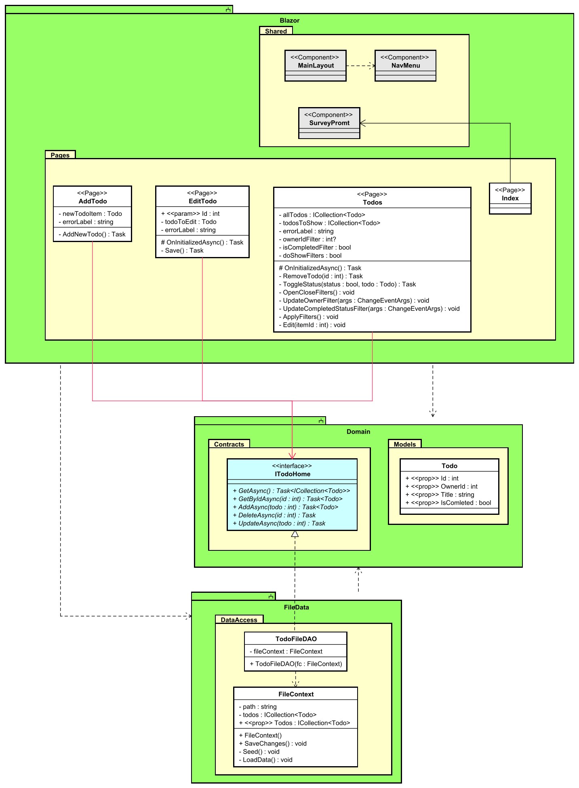

# Status

Now you have been through the very basics of Blazor.

* You have seen how to mix html and razor-syntax to dynamically render pages.
* You have seen how to use data-binding to dynamically display information on the pages.
* You have seen how to add event-listeners, so methods are called e.g. when clicking a button, or inserting text in a text field.

These are the basic elements, and you can make quite fancy apps with just this.

The next topic is more advanced, it is about how to use components for re-usability in your app, and better code-organization/structure. 
Use of components are not strictly necessary, you can get far without, but they make many things much easier. 

For example, some times pages can become quite large, and it is beneficial to be able to split a page into smaller parts, in separate files.
This can really help with the organization. For this, we can use components.

### Class Diagram
Currently, our app looks like what is shown below. Please note how pages, components, and properties are denoted:

### Sequence Diagram
In process..?