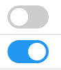

# Components

So far, we have mostly worked with pages, but not really utilized components. It may take some practice to get used to
use components, but they are very powerful for re-usability.

The smallest UI elements can be made into components. Take the toggle button, we use to set a Todo as completed:



These are essentially checkboxes, just with a bunch of styling applied to make them look nicer (or at least different).

If we wanted to use these again in a different place of the app, your initial thought might be to just copy the code:

```razor
<label class="switch">
    <input  type="checkbox" 
            checked=@item.IsCompleted 
            @onchange="@((arg) => ToggleStatus((bool)arg.Value, item))">
    <span class="slider round"></span>
</label>
```

But if you want a uniform look on your app, you will have to update multiple places, if the look of the toggle button changes.

There are several third party libraries which provides many different UI elements:
* Blazor fluent UI, found [here](https://www.blazorfluentui.net/)
* Radzen, found [here](https://www.radzen.com/)
* Syncfusion, found [here](https://www.syncfusion.com/blazor-components)
* Blazored, found [here](https://giters.com/Blazored)
* AntBlazor, found [here](https://antblazor.com/en-US/)
* MudBlazor, found [here](https://mudblazor.com/)


On the next slide we will extract a ToggleComponent as an example.

Code is found in [this branch](https://github.com/TroelsMortensen/BlazorTodoApp/tree/6ToggleComponent)