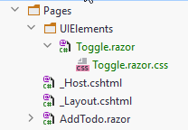

# Toggle Component

First, we need some organization. Currently all pages are just in the pages directory, but that can eventually get messy.

Create a new directory in Pages, called UIElements.

Inside here create a new blazor component (it's just a page without the @page directive at the top), call it Toggle.razor.
We will also need a style-behind.



### Styling

Let's start with the styling. The current toggle in Todos.razor has some classes, located in the `Todos.razor.css`, we can just copy those, and so your `Toggle.razor.css` looks like this:

```css
.switch {
    position: relative;
    display: inline-block;
    width: 60px;
    height: 34px;
}

.switch input {
    opacity: 0;
    width: 0;
    height: 0;
}

.slider {
    position: absolute;
    cursor: pointer;
    top: 0;
    left: 0;
    right: 0;
    bottom: 0;
    background-color: #ccc;
    -webkit-transition: .4s;
    transition: .4s;
}

.slider:before {
    position: absolute;
    content: "";
    height: 26px;
    width: 26px;
    left: 4px;
    bottom: 4px;
    background-color: white;
    -webkit-transition: .4s;
    transition: .4s;
}

input:checked + .slider {
    background-color: #2196F3;
}

input:focus + .slider {
    /*box-shadow: 0 0 1px #2196F3;*/
}

input:checked + .slider:before {
    -webkit-transform: translateX(26px);
    -ms-transform: translateX(26px);
    transform: translateX(26px);
}

/* Rounded sliders */
.slider.round {
    border-radius: 34px;
}

.slider.round:before {
    border-radius: 50%;
}
```

You may not need everything, but I just copied an example from w3 schools, and am not entirely sure what's going on.

You can now delete the same styling from Todos.razor.css.

### The component

The component is fairly simple, the entire class looks like this:

```razor
@namespace UIElements

<label class="switch">
    <input  type="checkbox" 
            checked=@IsCompleted 
            @onchange="@((arg) => Callback.InvokeAsync((bool)arg.Value))">
    <span class="slider round"></span>
</label>

@code {
    [Parameter]
    public EventCallback<bool> Callback { get; set; }

    [Parameter]
    public bool IsCompleted { get; set; }
}
```

**Line 1:** Whenever blazor components are split across different directories, we need to use namespaces.
Here we have defined that the Toggle-component is located in UIElements namespace. Other components who wants to use the Toggle must then have a `@using UIElements`.

**Lines 3-8:** This was mainly stolen from the Todos.razor. 
With a few minor changes. Notice the `<input>` element is split across multiple lines (4-6) for readability.

**Line 4:** We define the `<input>` as a checkbox.

**Line 5:** We say the checked-status, i.e. checked or un-checked, is read from the property `IsCompleted`, in the code block.
The value is provided from the outside of the component.

**Line 6:** We define the method to be called (lambda expression) when the value of the checkbox changes, i.e. from checked to un-checked or vice versa.\
What we do, is call a type of delegate, the `Callback`, with the value of the checkbox, `arg.Value`. 
It is sort of like an observer pattern. 
Other components can subscribe methods to this event, and get the boolean value.
This is a _very_ common approach to component-communication.\
We have previously seen the page directive argument, which is another way of components communicating.

In the code block we have two properties, marked as `[Parameter]`, meaning this value can be set from the outside.

The `EventCallback<bool>` is a delegate, meaning methods/lambda expressions can be added to it, and when the Callback is invoked, all added methods are called.

The bool property is just for the checked/un-checked value of the checkbox.

### Usage
Now that we have the component, how is it used?

In Todos.razor we must make changes.

First, at the top, we must declare a using statement to get access to the UIElements namespace:

```razor{4}
@page "/Todos"
@using Domain.Models
@using Domain.Contracts
@using UIElements
@inject ITodoHome TodoHome
@inject NavigationManager navMgr
```

Next, we modify the table:
```razor{7-9}
@foreach (var item in todosToShow)
{
    <tr>
        <td>@item.OwnerId</td>
        <td>@item.Id</td>
        <td>@item.Title</td>
        <td>
            <Toggle IsCompleted="@item.IsCompleted" Callback="@(b => ToggleStatus(b, item))"/>
        </td>
        <td>
             Edit(item.Id))"/>
        </td>
        <td>
            <label @onclick="@(() => RemoveTodo(item.Id))" 
                style="cursor:pointer; color: red; font-weight: bold">
                &#x2717;
            </label>
        </td>
    </tr>
}
```

Notice lines 7-9 previously contained the html/code for the toggle.
Now it is just a reference to our Toggle component. We pass two arguments, you can compare this to constructor arguments.

The Toggle asked for a bool, which we give to it through `IsCompleted="@item.IsCompleted"`.
It also asked for a method for the Callback, and here we give it a lambda expression.
`b` is the bool-value from the checkbox, we pass that together with the todo `item` to the `ToggleStatus()` method. 

That should be all. Run a test of the app to make sure nothing broke.

You can now use the Toggle component in a similar way all over your app, good for consistency and reusability.
