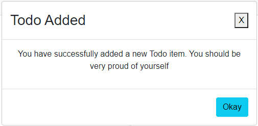

# Show popup when Todo is added successfully

We will edit the AddTodo.razor, so that the modal is shown when a Todo is added.

### Code
First, remember to add a using statement: `@using UIElements`.

Then a few changes to the code block of AddTodo.razor:

```csharp
@code {
    private Todo newTodoItem = new Todo();
    private string errorLabel = String.Empty;
    
    private bool showModal;
    
    private async Task AddNewTodo()
    {
        errorLabel = "";
        try
        {
            await TodoHome.AddAsync(newTodoItem);
            showModal = true;
            newTodoItem = new Todo();
        }
        catch (Exception e)
        {
            errorLabel = e.Message;
            return;
        }
    }

    private void Proceed()
    {
        showModal = false;
        NavMgr.NavigateTo("/Todos");
    }
}
```

Previously, around line 13, we would navigate to the Todos overview, but that is now removed.\
In line 14 we reset the view so that the `OwnerId` and `Title` is cleared.\
We have a new method in line 23, which will just disable the modal and navigate to the Todos overview.

### View

Next, we need to add the modal to the view. It is a simple approach, where it is hardcoded in, and just shown if a boolean is true.\
This is slightly inconvenient because you must include the modal in every view, where it can be used.\
If you use is as an error message, instead of our usual `errorLabel`, the modal must be in almost every page.

Other libraries have smarter ways, where it is just a method call to a utility class.

However, we start out simple.

The view is just updated at the end, after the `<EditForm>`, so the below is a fragment of the view:

```razor
    @if (!string.IsNullOrEmpty(errorLabel))
    {
        <label>@errorLabel</label>
    }
    @if (showModal)
    {
        <Modal 
            Title="Todo Added" 
            AcceptButtonText="Okay" 
            OnAcceptButton="Proceed" 
            OnCloseButton="() => showModal = false">
            
            <p>You have successfully added a new Todo item. You should be very proud of yourself</p>
        
        </Modal>
    }
</div>
```

The first if-statement was already present. The second, `@if(showModal)` is new. The modal tag is spread across multiple lines for readability.

**Lines 8-11** are various arguments: The title of the modal, then the text on the accept button.

**Line 10** defines which method, `Proceed()`, should be called, when the accept button is clicked.

**Line 11** happens when the little top-right <kbd>x</kbd> is pressed, i.e. we just turn off the modal.

**Line 13** is the `ChildContent`. I have just added a simple piece of html, a `<p>` tag with a message, but you can put anything here, and it will be put in the Modal.

The result, when adding a Todo, is now:



If you click the <kbd>x</kbd>, the modal closes, the input fields are reset, and you remain on the page.

If you click accept, you are taken to the todos overview.