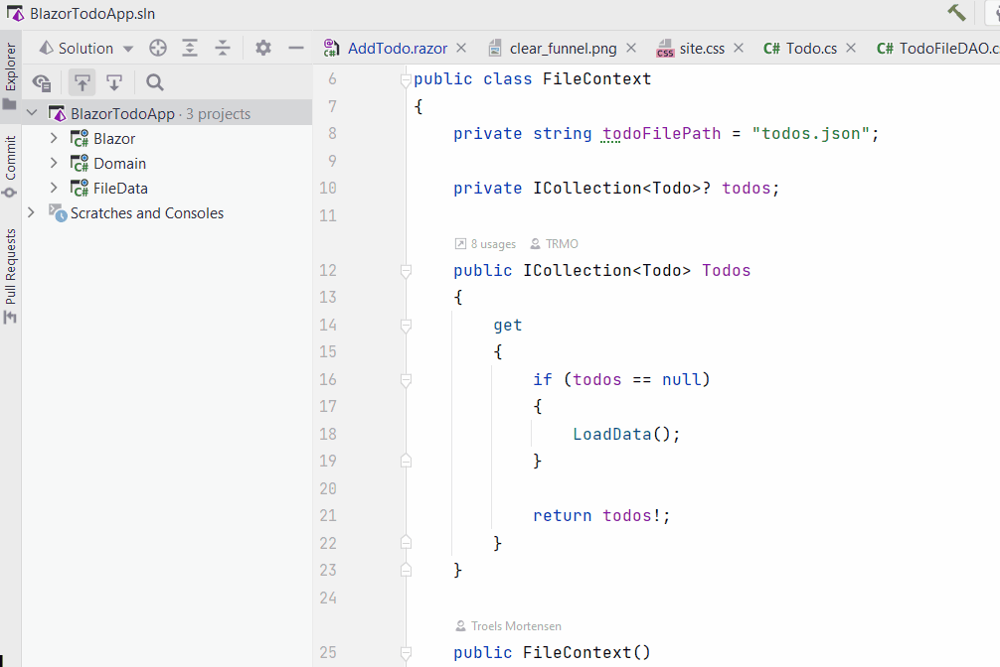
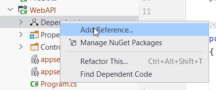

# New Web API component

Create a new Web API project:



Now, we need to add a dependency to Domain component.



Now you're at it, also add dependency to FileData.

## Services

This component needs to access data, through the FileData component. This means we must add as a service an `<ITodoHome, TodoFilDAO>`.
This service depends on the `FileContext`, which must also be added.

Do that in the `Program.cs` of WebAPI:

```csharp
builder.Services.AddScoped<ITodoHome, TodoFileDAO>();
builder.Services.AddScoped<FileContext>();
```