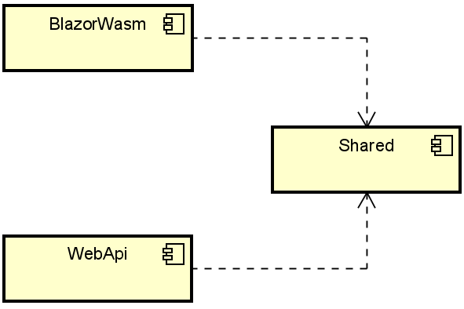
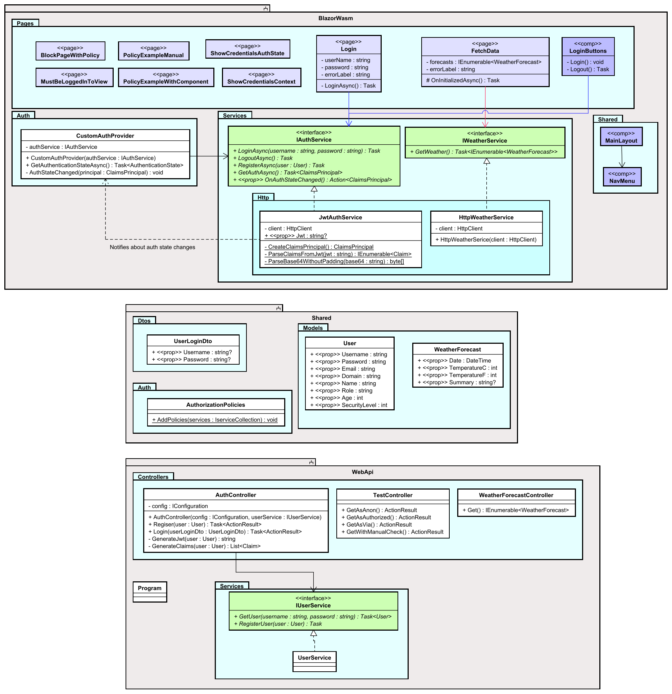
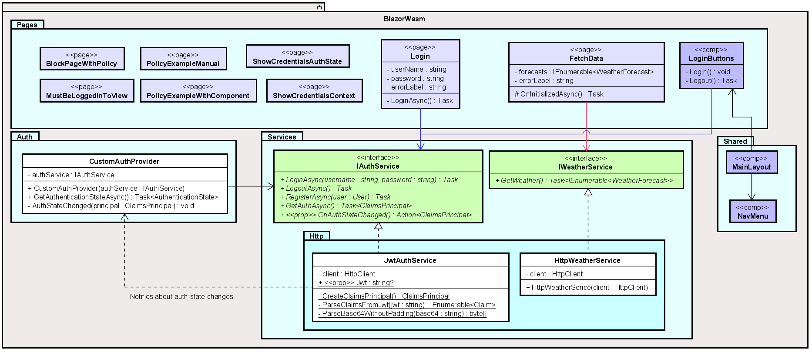
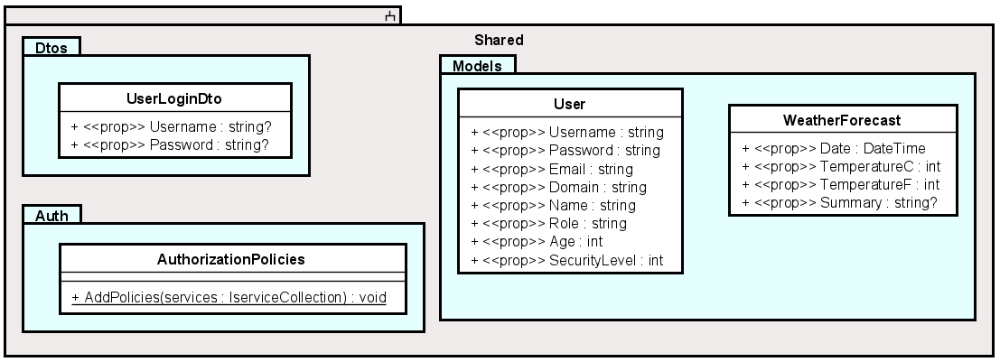
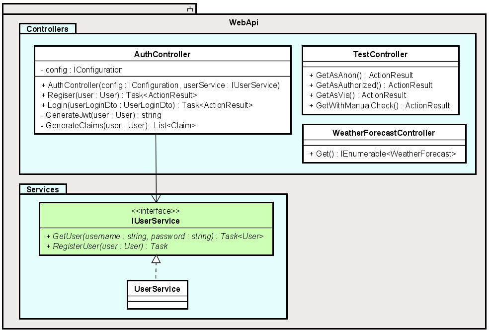

# Overview
First, an overview of the resulting system is presented.

We are going to need 3 libraries, 
1) The Web API
2) Blazor WASM
3) A shared library for classes/functionality needed by both projects.

The various endpoints on the Web API will be secured by policies and whether the endpoint, when called, is given a valid JWT. 
So, un-authorized/un-authenticated requests to the Web API will automatically be refused.

For the Blazor app, the authentication/authorization will be used to show/hide various parts of the UI, i.e. you can only see certain pages, tabs, buttons, etc, if your logged in user has the correct privileges.

### Component diagram
The below diagram shows the dependencies between our three projects.

You could put an arrow from BlazorWASM to WebAPI, as HTTP requests are made from Blazor to the endpoints in the Web API. 
But as that dependency is not explicit in the solution, it is left out.

### Class diagram

The below class diagram shows the end result. It may not be an exact match, as the last part of this tutorial will contain some optimizations, resulting in changes to the system.

First the overview is provided. Below, various parts of the diagram will be explained in detail.

The grey boxes are projects (components). Below, each project is discussed.

#### Blazor app
This is the Blazor app.

Notice how Blazor pages are marked as the stereotype `<<page>>`. Similarly, components are marked `<<comp>>`.

Most of the pages don't do much in themselves, they are just there to demonstrate how to show/hide parts of the UI based on the authorization state. These "dumb" pages include: BlockPageWithPolicy, MustBeLoggedInToView, PolicyExampleManual, PolicyExampleWithComponent, ShowCredentialsAuthState, ShowCredentialsContext.

The `Login` page is used by the user to log in. The credentials are forwarded to the `IAuthService`, and the implementation, `JwtAuthService` will make a request to the Web API. Once the response is received, a notification is sent to the CustomAuthProvider, which will cause a reaction in the UI according to the new authorization state. I.e., the dotted arrow from JwtAuthService to CustomAuthProvider does not in this case mean a "dependency", I have abused notation a little. It just means a notification is sent. Think observer design pattern.

The `FetchData` page is included in the Blazor template, i.e. it is there upon creation. We keep it to show how to get data from the Web API, by using the `IWeatherService`, and its implementation, `HttpWeatherService`.

The `LoginButtons` is a component used by the MainLayout to give a little login-icon on the top-right of the app. This will be elaborated upon later.

Finally, the `CustomAuthProvider` is the class responsible for providing the Blazor app auth functionality with the authorization state. You may notice the method `GetAuthenticationStateAsync()`.
This method is called by the Blazor framework, whenever there is something in the UI which needs to know about the authorization state. If you wish to show/hide a button, the Blazor framework will ask this class, through this method, about the currently logged in user, and based on that user's credentials, the button will be either shown or hidden.\
CustomAuthProvider does not know about the user itself, but asks the IAuthService about the credentials every time.

#### Shared
This component contains classes and features which both the Blazor app and the Web API needs to know about.

All model classes are put here, so that we do not need to have copies of `User` in both Web API and Blazor projects.

We have the Data Transfer Objects here. Whenever you need to log in, you just need to provide a username and a password. We could have used the User class to send this information from Blazor to Web API, and just leave most properties empty.
But it is common practice to create specialized Data Transfer Objects, which contains just the properties needed. It is up to you, which approach you will use.

The `AuthorizationPolicies` is a class, where we define policies. The policies are the same on both Blazor and Web API, so they are defined here.

Policies are set of rules to be used to either provide or block access, based on a users credentials. For example:

* You can only view this image, if you are older than 18
* You can only click this button, if your email is from VIA
* You can only access this page, if your security level is above 3

The same applies for the Web API:

* You can only call this endpoint, if you are older than 18
* You can only call this endpoint, if your email is from VIA

So, we can use policies to control our UI, and we can use policies to control who can call our Web API endpoints, so they are not just open to the entire world. That is potentially very dangerous, as anyone can create and delete our data.

#### Web API
This is the Web API:

The `AuthController` is used to login, and receive a JWT. You can also register a new `User` here, however, that is not really included in this tutorial, and instead left to the reader, to implement. If they wish.\
This class will use the `IUserService` to validate the login credentials, and if valid, will generate a JWT and return it to the caller, i.e. the Blazor app.

The `TestController` has a few dummy endpoints to demonstrate how to use policies and other approaches, to block access if the caller is un-authorized.

The `WeatherForecastController` just returns a set of random `WeatherForecast` objects to be displayed on the page `FetchData`.

### Now, let's get started on implementation.