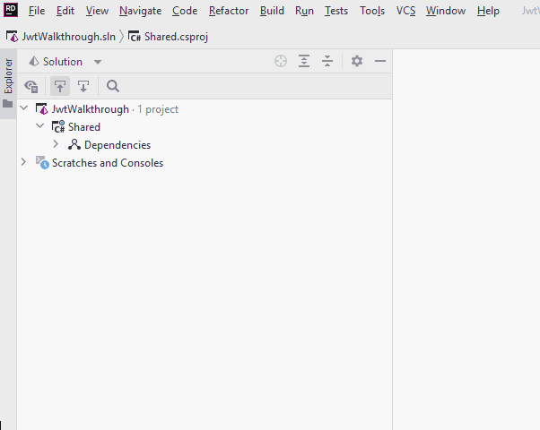
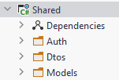

# Shared project
We will start here, as this project does not depend on the others.

First, create a new class library, call it `Shared`:


Delete the `Class1.cs` file.

### NuGet packages
Next, we must add a package to this project, to get access to various functionality regarding authorization and policies.

Add the package "Microsoft.AspNetCore.Authorization". **Pick the latest non-preview version!**.



### Directories
Create three directories inside the Shared project:
* Auth
* Dtos
* Models



### Model classes
Inside the Models directory create a User class:

```csharp
public class User
{
    public string Username { get; set; }
    public string Password { get; set; }
    public string Email { get; set; }
    public string Domain { get; set; }
    public string Name { get; set; }
    public string Role { get; set; }
    public int Age { get; set; }
    public int SecurityLevel { get; set; }
}
```

These properties are just to demonstrate various ways to use auth policies. You may not need them for you own project, but in this tutorial they are useful.

Inside the Models directory create a WeatherForecast class:

```csharp
public class WeatherForecast
{
    public DateTime Date { get; set; }

    public int TemperatureC { get; set; }

    public int TemperatureF => 32 + (int)(TemperatureC / 0.5556);

    public string? Summary { get; set; }
}
```

This class will later also be defined by default in Blazor and Web API projects, which must then be deleted. You will be told when.

### Dto
Inside the Dtos directory create a UserLoginDto class:

```csharp
public class UserLoginDto
{
    public string Username { get; init; }
    public string Password { get; init; }
}
```

Notice the `init;`. This is a specific kind of `set;`, meaning you can only set this values, when the object is created, but not later modify it. It is not strictly necessary, but in general it is good practice to only allow what is supposed to be available. We don't intend to change the values after creation, so we don't allow that.
It is just a minor detail.

### Auth
Finally, the class which will define the policies.

Inside the Auth directory create a class called `AuthorizationPolicies`:

```csharp
public static class AuthorizationPolicies
{
    public static void AddPolicies(IServiceCollection services)
    {
        services.AddAuthorizationCore(options =>
        {
            options.AddPolicy("MustBeVia", a =>
                a.RequireAuthenticatedUser().RequireClaim("Domain", "via"));
    
            options.AddPolicy("SecurityLevel4", a =>
                a.RequireAuthenticatedUser().RequireClaim("SecurityLevel", "4", "5"));
    
            options.AddPolicy("MustBeTeacher", a =>
                a.RequireAuthenticatedUser().RequireClaim("Role", "Teacher"));
    
            options.AddPolicy("SecurityLevel2OrAbove", a =>
                a.RequireAuthenticatedUser().RequireAssertion(context =>
                {
                    Claim? levelClaim = context.User.FindFirst(claim => claim.Type.Equals("SecurityLevel"));
                    if (levelClaim == null) return false;
                    return int.Parse(levelClaim.Value) >= 2;
                }));
        });
    }
}
```

You must import:
* using Microsoft.Extensions.DependencyInjection;
* using System.Security.Claims;

to fix compiler errors.

Now, what's going on here? This static method will be called from the `Program.cs` classes in both Web API and Blazor, and it will add authorization policies to the framework.

Each line starting with `options.AddPolicy...` adds a new policy, which can then be used to guard UI elements or Web API endpoints.

**The first policy** is called "MustBeVia", that's the name of it, and this name is used for reference. Then the lambda expression says:
* `RequireAuthenticatedUser()`, meaning to fulfill this policy the user is logged in, and authenticated.
* `RequireClaim("Domain", "via")`, meaning the user must have a claim, where the type is "Domain", and the value is "via". So, the Domain property of that specific user object must have the value "via". 

**The next policy**, called "SecurityLevel4" also requires an authenticated user, and that the "SecurityLevel" is _either_ "4" or "5". This illustrates you can add any number of valid values. The RequireClaim method takes first the Claim name, and then any number of arguments.

**The third policy**, "MustBeTeacher" says that the "Role" of the user must be "Teacher".

**The fourth policy** is an example of slightly more complicated logic. We use the method `RequireAssertion()`, and if the logic inside returns "true", the user fulfills this policy.\
The `context` contains a User property, of the type `ClaimsPrincipal`. This is a type of object, which the Authentication framework understands, it contains information about the user.\
We use `FindFirst()` to find the first Claim with the Type of "SecurityLevel". If no such claim exists, the user has no security level, and we return "false". If the claim is found, we check if the security level is above a certain value, in this case level 2.

### What is a ClaimsPrincipal?
In your project, either this tutorial, or other projects like SEP3, you will probably define some kind of User object, maybe you call it User, Account, or something else. But it is a class you define to hold information about a user.\
This is a custom object, and the Authentication functionality of Blazor and Web API obviously does not know about your specific user type. 

Therefore we must convert our custom User into a class which the framework understands. That class is the ClaimsPrincipal. How it's done will be covered later.