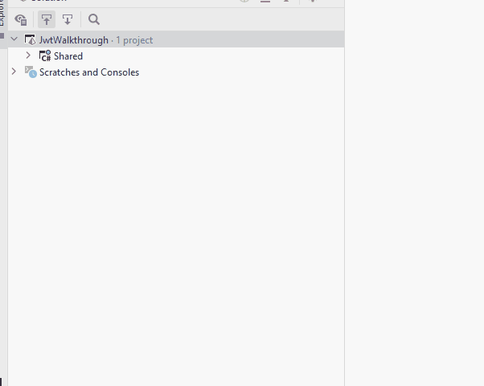
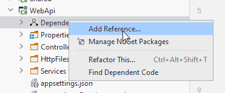
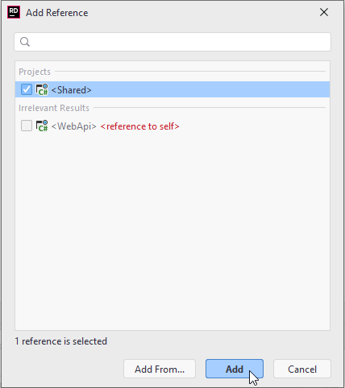

# The Web API
Next up is the Web API. We will do the Blazor app last.

Create a new Web API project, give it a name, e.g. "WebAPI":



### Add inter-project dependency
We must add a dependency from **Web API** project to **Shared** Project, so that the Web API can use classes and functionality defined in the Shared project.

Right click the "Dependencies" inside WebApi project:



Then in the opened window select the Shared project and click <kbd>Add</kbd>.



### Clean up
The Web API template project comes with a `WeatherForecast.cs` class. Delete it.

Open Controllers/WeatherForecastController.cs, and quick fix (<kbd>alt</kbd> + <kbd>enter</kbd>) the compile error, i.e. import the WeatherForecast class from the Shared/Models.

### Add NuGet packages
This project also needs a package to handle JWT creation and authorization.

Similarly to how you added a package to the Shared project, add the following package to the Web API project:

* Microsoft.AspNetCore.Authentication.JwtBearer

At the time of writing, the version of the package is 6.0.8. Pick the latest non-preview package.


## Modify Program.cs
Open the Program.cs class.

### Tell the app to use authentication

Add the following line anywhere above `app.Run()`, and below `var app = builder.Build();`:

```csharp
app.UseAuthentication();
```

This adds authentication middleware, i.e. somewhere between the Web API server recieves the request, and our controller endpoint is called, a class will now handle authentication checks, and if the caller is not authenticated or authorized as required, a "401 - Unauthorized" error will be returned to the caller.

### Tell the app to accept requests from the browser

Next, add the following code anywhere above `app.Run()` and below `var app = builder.Build();`:

```csharp
app.UseCors(x => x
    .AllowAnyMethod()
    .AllowAnyHeader()
    .SetIsOriginAllowed(origin => true) // allow any origin
    .AllowCredentials());
```

This is needed later when our Blazor app, running in the browser, needs to contact localhost. For security reasons (I believe) this is not allowed by default. 

### Add authentication with info about JWT
Finally, add the following piece of code anywhere above `var app = builder.Build();`:

```csharp
builder.Services.AddAuthentication(JwtBearerDefaults.AuthenticationScheme).AddJwtBearer(options =>
{
    options.RequireHttpsMetadata = false;
    options.SaveToken = true;
    options.TokenValidationParameters = new TokenValidationParameters()
    {
        ValidateIssuer = true,
        ValidateAudience = true,
        ValidAudience = builder.Configuration["Jwt:Audience"],
        ValidIssuer = builder.Configuration["Jwt:Issuer"],
        IssuerSigningKey = new SymmetricSecurityKey(Encoding.UTF8.GetBytes(builder.Configuration["Jwt:Key"]))
    };
});
```
Import the necessary stuff, quick fix it.
A bunch of stuff is happening here. I stole this from an example, so I don't know all the details.

You may notice how we retrieve information from the appsettings.json, e.g. in line 9, 10, 11 above with the:

`builder.Configuration["Jwt:Audience"]`

This goes to the Jwt section, then the Audience line, getting the value. Similar with the other two lines. Further details below.

### Add policies
Add the following line of code anywhere **above** `var app = builder.Build();`:

```csharp
AuthorizationPolicies.AddPolicies(builder.Services);
```

Quick fix import compile errors.

This is our class from the Shared project, so here we tell the Web API to add authorization policies.

## appsettings.json
Open the WebApi/appsettings.json file. This contains various settings for our program.

We need to add information about the JWT to generate.

Add a "Jwt" section, so your file content looks like this:

```json
{
  "Logging": {
    "LogLevel": {
      "Default": "Information",
      "Microsoft.AspNetCore": "Warning"
    }
  },
  "AllowedHosts": "*",
  "Jwt": {
    "Key": "This Is My Random Secret Key Which Is At Least Sixteen Characters",
    "Issuer": "JWTAuthenticationServer",
    "Audience": "JWTServiceBlazorWasmClient",
    "Subject": "JWTServiceAccessToken"
  }
}
```

Here we have specified various settings to be used when generating the JWT. 
* The "Key" is a secret key used when encrypting. It must be at least 16 characters, and can just be anything random.
* The Issuer is who generated the JWT
* The Audience is who the JWT is intended for
* The Subject... I'm not sure

