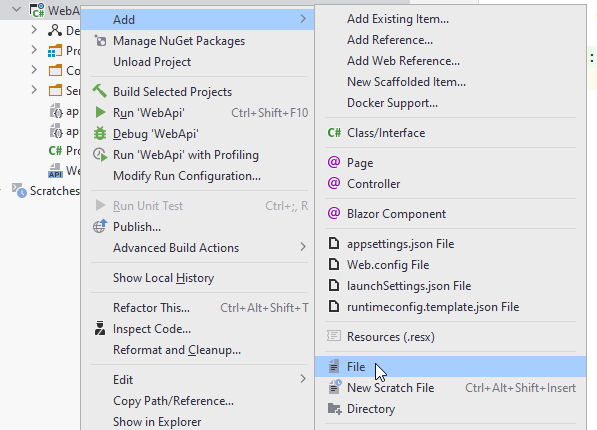
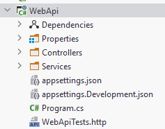
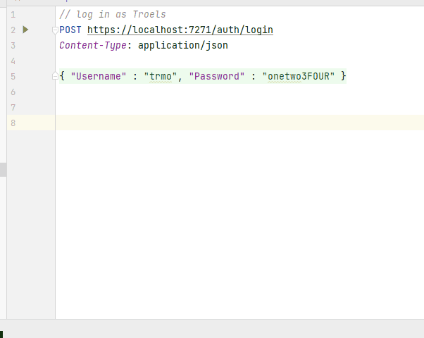
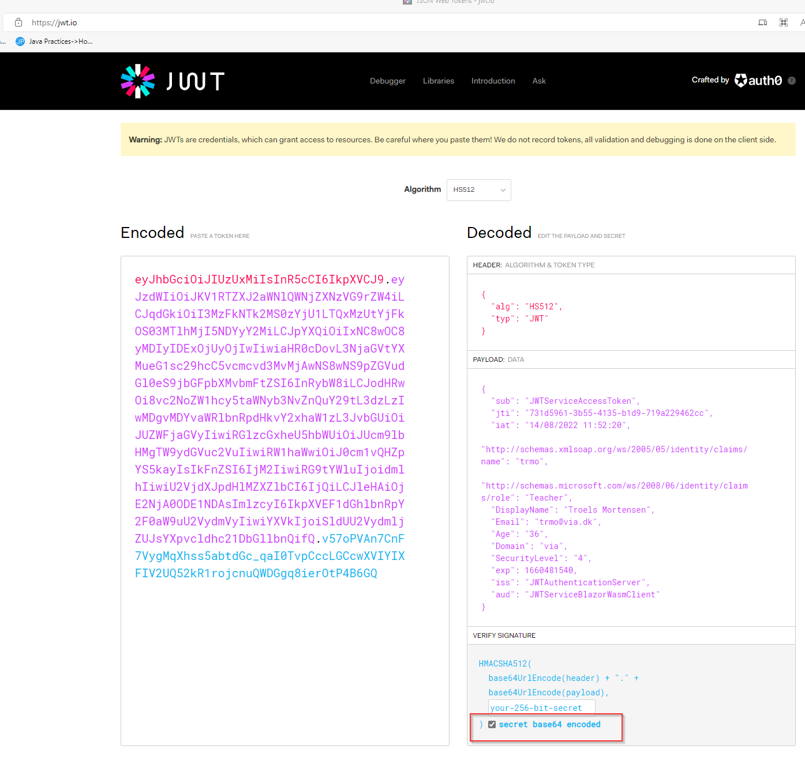

# Testing the login
It's time to test whether we can log in.

Normally, when you run your Web API, it opens a Swagger page. You can test the Login endpoint from here, and if you provide valid credentials, you should get a JWT back.

However, future calls which requires the JWT attached are more complicated to create with Swagger. We would have to add stuff in the Program.cs, and complicate things.

So, we'll do something else. We could use Postman, that would be easy enough, and if you prefer that, go for it.

### The .http test file
Rider has a built in Http Client. It's pretty simple.

In the WebApi project folder, create a new file. Call it "WebApiTests.http", or whatever, but the file type is ".http":



And here's the file:



Open the file. In here we can define calls to our Web API.

Input the following:

```http
// log in as Troels
POST https://localhost:7130/auth/login
Content-Type: application/json

{ "Username" : "trmo", "Password" : "onetwo3FOUR" }
```

The // marks a comment.

Then we define a "POST" request to "https://localhost:7130/auth/login".

We define the Content-Type to be "application/json", i.e. saying the request contains content in the format of JSON.

Finally a JSON object matching the format of our `UserLoginDto`.

Run the Web API, and then run your test. You should receive a JWT.



In my test I received the following JWT:

"eyJhbGciOiJIUzUxMiIsInR5cCI6IkpXVCJ9.eyJzdWIiOiJKV1RTZXJ2aWNlQWNjZXNzVG9rZW4iLCJqdGkiOiI3MzFkNTk2MS0zYjU1LTQxMzUtYjFkOS03MTlhMjI5NDYyY2MiLCJpYXQiOiIxNC8wOC8yMDIyIDExOjUyOjIwIiwiaHR0cDovL3NjaGVtYXMueG1sc29hcC5vcmcvd3MvMjAwNS8wNS9pZGVudGl0eS9jbGFpbXMvbmFtZSI6InRybW8iLCJodHRwOi8vc2NoZW1hcy5taWNyb3NvZnQuY29tL3dzLzIwMDgvMDYvaWRlbnRpdHkvY2xhaW1zL3JvbGUiOiJUZWFjaGVyIiwiRGlzcGxheU5hbWUiOiJUcm9lbHMgTW9ydGVuc2VuIiwiRW1haWwiOiJ0cm1vQHZpYS5kayIsIkFnZSI6IjM2IiwiRG9tYWluIjoidmlhIiwiU2VjdXJpdHlMZXZlbCI6IjQiLCJleHAiOjE2NjA0ODE1NDAsImlzcyI6IkpXVEF1dGhlbnRpY2F0aW9uU2VydmVyIiwiYXVkIjoiSldUU2VydmljZUJsYXpvcldhc21DbGllbnQifQ.A3ncVJsEcfYD5AArXR3F1tKYr7QaL7HQ_ln-kwWZbwXpx2aQz08DgVX2l8CnfZr7FxE8BzsrO7-A1Mru4Gklbg"

If you are interested, you can go to [jwt.io](https://jwt.io/) to unpack the token:


