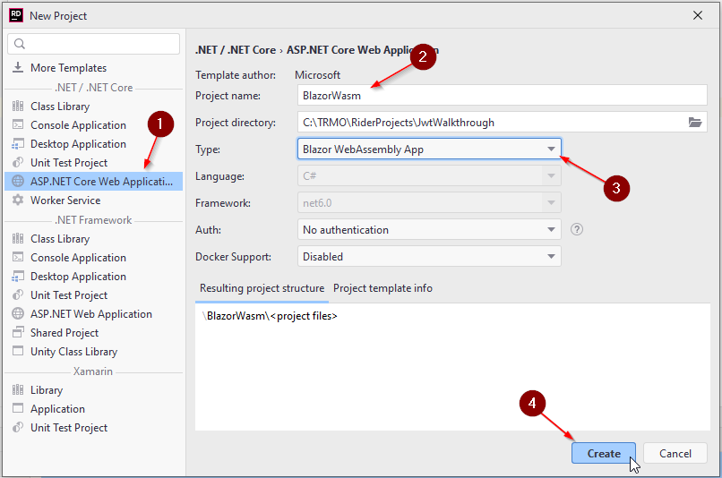
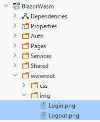

# Blazor
Now we start on the front end of things. 

We will see how to make a login request to our web api, receive a JWT and use that to guard various parts of the app.

### Create project

We start by adding a new project, of type Blazor-wasm.

### Add packages
Again, we need to add a package:

* Microsoft.AspNetCore.Components.Authorization

Remember to pick the latest non-preview version.

### Add reference
Add a project-reference to Shared, similar to what we did with the Web API, so that we get access to the models and the policy setup in that library.

### Icons
We are going to use two icons for login and logout. It's not strictly necessary, but let's try it out.

You should be able to right click and download the two images below:

Place them here in your blazor project:

