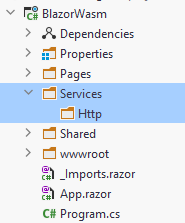

# AuthService class
This class handles login requests, user-registration requests (not covered in tutorial), and logging out.

### Directories
Inside the project folder create a new directory: Services.
Inside that create a directory: Http.



We don't strictly need the Http directory, it's just to organize things. In this folder we put service implementations related to Http, i.e. REST and our Web API. If we later wanted other services using e.g. gRPC or other, we could create another directory for that. It's just a detail.

### IAuthService interface
In the Service directory create an interface, IAuthService.

It looks like this:

```csharp
using System.Security.Claims;
using Shared.Models;

namespace BlazorWasm.Services;

public interface IAuthService
{
    public Task LoginAsync(string username, string password);
    public Task LogoutAsync();
    public Task RegisterAsync(User user);
    public Task<ClaimsPrincipal> GetAuthAsync();

    public Action<ClaimsPrincipal> OnAuthStateChanged { get; set; }
}
```

Fix imports.

All methods return Tasks, to support asynchronous programming.

The first method is used to log in, from a log in page.\
The second is to log out, i.e. clear your authentication state and become anonymous.\
Then a method to register a new user, though not covered in this tutorial.\
The GetAuthAsync() method is used to provide authentication state details to the blazor framework, whenever the app needs to know about who is logged in.\
The last is an Action, which will fire an event whenever the authentication state changes, i.e. upon log in or log out.

### JwtAuthService
In the Http directory create a class "JwtAuthService.cs".

It's a long class, we'll cut it up. The end result [is found on GitHub here](https://github.com/TroelsMortensen/JwtAuth/blob/master/BlazorWasm/Services/Http/JwtAuthService.cs).

#### Fields
This is the start of the class:

```csharp
public class JwtAuthService : IAuthService
{
    private readonly HttpClient client = new ();

    // this private variable for simple caching
    public static string? Jwt { get; private set; } = "";

    public Action<ClaimsPrincipal> OnAuthStateChanged { get; set; } = null!;
```

It implements the interface IAuthService, so we must provide implementations for the methods defined in the interface.

We have a static public field variable called `Jwt`. This will hold the token received from the Web API when logged in. It is static because other services need this token when making requests to the Web API, we will see that later. The variable being static provides easier access to it. 

Normally static references results in tight couplings, i.e. something to avoid. But the coupling is only within the same layer, so we allow it here. The coupling can be loosened, but that is not relevant for this tutorial.

The last line is the implementation of the Action. Now, other classes can subscribe and listen for events being fired about the authentication state changing. We will need that later.

#### Parsing the JWT
We will need functionality to convert the JWT received from the Web API into Claims with information about the user logged in.

Paste in the below two methods:

```csharp
// Below methods stolen from https://github.com/SteveSandersonMS/presentation-2019-06-NDCOslo/blob/master/demos/MissionControl/MissionControl.Client/Util/ServiceExtensions.cs
private static IEnumerable<Claim> ParseClaimsFromJwt(string jwt)
{
    string payload = jwt.Split('.')[1];
    byte[] jsonBytes = ParseBase64WithoutPadding(payload);
    Dictionary<string, object>? keyValuePairs = JsonSerializer.Deserialize<Dictionary<string, object>>(jsonBytes);
    return keyValuePairs!.Select(kvp => new Claim(kvp.Key, kvp.Value.ToString()!));
}

private static byte[] ParseBase64WithoutPadding(string base64)
{
    switch (base64.Length % 4)
    {
        case 2:
            base64 += "==";
            break;
        case 3:
            base64 += "=";
            break;
    }

    return Convert.FromBase64String(base64);
}
```

How they work is irrelevant. Consider it black magic. The argument is the JWT, the result is a collection of Claims about the user.

### Creating the ClaimsPrincipal
We need a method to create a ClaimsPrincipal. Remember, this is the type of User object the auth-framework understands. So the JWT is converted into a ClaimsPrincipal with the following method:

```csharp
private static ClaimsPrincipal CreateClaimsPrincipal()
{
    if (string.IsNullOrEmpty(Jwt))
    {
        return new ClaimsPrincipal();
    }

    IEnumerable<Claim> claims = ParseClaimsFromJwt(Jwt);
    
    ClaimsIdentity identity = new(claims, "jwt");

    ClaimsPrincipal principal = new(identity);
    return principal;
}
```

If there is no JWT, i.e. no user is logged in, we return an "empty" ClaimsPrincipal. This is then anonymous.

Otherwise, we get the Claims from the JTW. We put those claims into a ClaimsIdentity, a kind of sub-user. We state the auth-type is "jwt".\
This ClaimsIdentity is then provided to a ClaimsPrincipal. I believe a ClaimsPrincipal may contain multiple Identities, though that's beyond this tutorial.

That's enough of helper methods. You may notice they are all private and _static_. They don't need to be static, but as they are just helper methods, making them static is in some cases a small optimization. It's just a detail, you don't need to do it.

### Login method
Now, the login method. It looks like this:

```csharp
public async Task LoginAsync(string username, string password)
{
    UserLoginDto userLoginDto = new()
    {
        Username = username,
        Password = password
    };

    string userAsJson = JsonSerializer.Serialize(userLoginDto);
    StringContent content = new(userAsJson, Encoding.UTF8, "application/json");

    HttpResponseMessage response = await client.PostAsync("https://localhost:7130/auth/login", content);
    string responseContent = await response.Content.ReadAsStringAsync();

    if (!response.IsSuccessStatusCode)
    {
        throw new Exception(responseContent);
    }

    string token = responseContent;
    Jwt = token;

    ClaimsPrincipal principal = CreateClaimsPrincipal();

    OnAuthStateChanged.Invoke(principal);
}
```

First a UserLoginDto object is created with username and password. Remember, this is what the Web API needed to validate a user.

The object is serialized into JSON. That JSON is put into a `StringContent` object, using Encoding UTF8, and specifying the content is on JSON-format.

We make a Post request in line 12, and in line 13 we read the response content, which should be our JWT.

**Remember to change the port to match your Web API's!**

If there is a problem with the request, i.e. we get an error code back, we throw an Exception. This exception is caught in a page, and an error message is shown to the user. It is always _very_ important to give feedback to the user, both upon success and failure. 

We assign the received jwt to the property `Jwt`. This property is a form of [cache](https://en.wikipedia.org/wiki/Cache_(computing)). From wiki:

> ... is a hardware or software component that stores data so that future requests for that data can be served faster

It's just a temporary storage to hold data which is needed in the future. If we didn't store the JWT we would need to log in all the time. It wouldn't work. This cache is simple, and the last part of this tutorial will cover small improvements. But we start out simple.

We get the ClaimsPrincipal and finally invoke the Action to notify whoever is interested about the change in authentication state.


### Register User
We include a method to register a user. You may later create a page for registering users if you wish.

```csharp
public async Task RegisterAsync(User user)
{
    string userAsJson = JsonSerializer.Serialize(user);
    StringContent content = new(userAsJson, Encoding.UTF8, "application/json");
    HttpResponseMessage response = await client.PostAsync("https://localhost:7130/auth/register", content);
    string responseContent = await response.Content.ReadAsStringAsync();

    if (!response.IsSuccessStatusCode)
    {
        throw new Exception(responseContent);
    }
}
```

Remember to change the port number!

### Register service
Finally, we need to register the interface and implementation as a service, so the app can use them for dependency injection.

Open BlazorWasm/Program.cs, add the line:

```csharp
builder.Services.AddScoped<IAuthService, JwtAuthService>();
```

