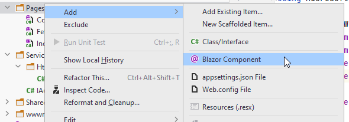
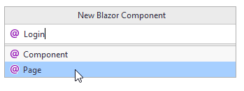
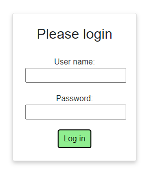

# The login page
We need to be able to log in. This requires a page where we can input our credentials.

In the Pages directory, create a new page:



And then input name, and select "Page":



### The code
At the top of the file, you should have these four lines:

```razor
@page "/Login"
@using BlazorWasm.Services
@inject IAuthService authService
@inject NavigationManager navMgr
```

We declare the page directive, i.e. the sub-uri to get to the Login page.\
There is a using statement, and then two @inject statements. This gives us an instance of IAuthService (i.e. the JwtAuthService) and an instance of the NavigationManager.

The code block is here:

```csharp
@code {
    private string userName;
    private string password;
    private string errorLabel;

    private async Task LoginAsync()
    {
        errorLabel = "";
        try
        {
            await authService.LoginAsync(userName, password);
            navMgr.NavigateTo("/");
        }
        catch (Exception e)
        {
            Console.WriteLine(e);
            errorLabel = $"Error: {e.Message}";
        }
    }
}
```

We have private fields to hold the username, the password, and any error message we might need to show to the user.

The `LoginAsync()` method will delegate to the IAuthService, attempting to log in. If succesful we use the NavigationManager to navigate to the home page.\
In the case of any exceptions, we catch them and display the error message through the `errorLabel`.

### The view
The below is the html/razor syntax for the view of the Login page:

```razor
<AuthorizeView>
    <NotAuthorized>
        <div class="card">
            <h3>Please login</h3>
            <div class="field">
                <label>User name:</label>
                <input type="text" @bind="userName"/>
            </div>
            <div class="field">
                <label style="text-align: center">Password:</label>
                <input type="password" @bind="password"/>
            </div>
            @if (!string.IsNullOrEmpty(errorLabel))
            {
                <div class="field">
                    <label style="color: red">
                        @errorLabel
                    </label>
                </div>
            }
            <div class="field">
                <button class="loginbtn" @onclick="LoginAsync">Log in</button>
            </div>
        </div>
    </NotAuthorized>
    <Authorized>
        <div class="card">
            <h3>Hello, @context.User.Identity.Name</h3>
        </div>
    </Authorized>
</AuthorizeView>
```

So, what's going on here?

We wrap everything in the <AuthorizeView> component. Inside this we have access to information about the ClaimsPrincipal representing the currently logged in user.

Notice the two sub-tags: `<NotAuthorized>` and `<Authorized>`.\
* The first is "active" if no one is logged in, i.e. all the html inside this tag is displayed.
* The second contains html shown if the user _is_ logged in.

In the NotAuthorized part we have two input fields for the username and password.

If the errorLabel contains something, we display that text. 

At the bottom we have the button, which when pressed calls the `LoginAsync()` method.

Inside the Authorized part we have access to the `context`, a variable of type `AuthenticationState`, so we can access the contained ClaimsPrincipal, and get the Name. Or any Claim we might want.

The Name property is set specifically, when you add a Claim to the ClaimsPrincipal with the `ClaimsType` of `ClaimsType.Name`. We did this in the Web API's AuthController:

`new Claim(ClaimTypes.Name, user.Username)`

``

### Styling
Add a style-behind to make the Login page look nicer. It could contain the following css:

```css
.card {
    box-shadow: 0 4px 8px 0 rgba(0,0,0,0.2);
    transition: 0.3s;
    width: 250px;
    padding: 25px;
    text-align: center;
    margin: auto;
    margin-top: 50px;
}

.field {
    margin-top: 20px;
}

.loginbtn {
    background-color:lightgreen;
    border-radius: 5px;
    padding: 5px;
    padding-left: 10px;
    padding-right: 10px;
}

.loginbtn:hover{
    transform: scale(1.1);
    box-shadow: 0 2px 10px 2px #3f3f3f;
}
```

The result should be this look:



You can check by running your Blazor app, and manually put in

`https://localhost:7105/login`

in the browser bar. Maybe with another port.