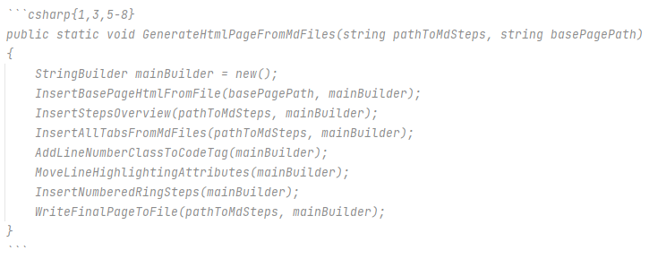

# CodeLabs documentation

The markdown used for this CodeLabs should support all the standard syntax.

I have then added a few extra commands.

## Code syntax highlighting

Code in code-blocks can be syntax highlighted by adding the programming language name after the three single quotes,
which starts a code block.

The below:


results in this:

```csharp
public static void Main(string[] args) {
    Console.WriteLine("Hello world");
}
```

## Code line highlight
When applying code syntax highlighting, you can furthermore highlight specific lines in yellow by appending the information after the programming language name.

* {x} will highlight line x
* {x-y} will highlight lines x _through_ y
* {x, y} will highlight lines x _and_

These can be used together, when separated by comma.

The following markdown



results in this output:

```csharp{1,3,5-8}
public static void GenerateHtmlPageFromMdFiles(string pathToMdSteps, string basePagePath)
{
    StringBuilder mainBuilder = new();
    InsertBasePageHtmlFromFile(basePagePath, mainBuilder);
    InsertStepsOverview(pathToMdSteps, mainBuilder);
    InsertAllTabsFromMdFiles(pathToMdSteps, mainBuilder);
    AddLineNumberClassToCodeTag(mainBuilder);
    MoveLineHighlightingAttributes(mainBuilder);
    InsertNumberedRingSteps(mainBuilder);
    WriteFinalPageToFile(pathToMdSteps, mainBuilder);
}
```

## Keyboard buttons

Sometimes you need to indicate a keyboard button, e.g. <kbd>ctrl</kbd><kbd>alt</kbd><kbd>del</kbd>.\
You can do this by surrounding the button text with `<kbd>A</kbd>` --> <kbd>A</kbd>.

## Red circle step indicators.
A red circle with a number, like ((3)) is done by surrounding the number by two parentheses on either side: ( ( 3 ) ).
