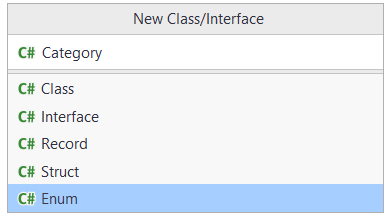

# Create Category
Next up, we need an enum, called Category:

```csharp
public enum Category
{
    Electronics,
    Grocery,
    Clothes
}
```

When creating a new class, there is actually an option to make it an enum right away:



Alterntively, just create a normal class, and change out `class` with `enum`.