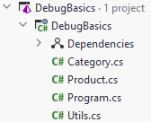

# Program class
Finally, we need the Program.cs. When you created a console application, the Program.cs will have been created for you.
You just need to modify it to look like this:

```csharp
public class Program
{
    public static void Main(string[] args)
    {
        ShowPricesWithVat();
    }

    private static void ShowPricesWithVat()
    {
        Console.WriteLine("Product prices incl. VAT:");

        foreach (var product in Products)
        {
            var vat = Utils.CalculateVat(product.Price, product.Category);
            var priceWithVat = Math.Round(product.Price + vat, 2);
            Console.WriteLine($"{product.Name}: {priceWithVat} EUR");
        }
    }

    private static readonly IEnumerable<Product> Products = new List<Product>
    {
        new Product("Batteries", Category.Electronics, 2.50),
        new Product("SD Card", Category.Electronics, 10),
        new Product("T-shirt", Category.Electronics, 15),
        new Product("Parmesan Cheese", Category.Grocery, 7.50),
        new Product("Tomatoes", Category.Grocery, 2),
    };
}
```

You will probably have to fix some namespace using. The Program.cs will have been put in a namespace named after the project. 
The previous classes, you created, may not have been given a namespace.

Fix any import mistakes. 

Your program should now compile. 

If you run it, you should get the below output in the console:

```console 
Product prices incl. VAT:
Batteries: 2.98 EUR
SD Card: 11.9 EUR
T-shirt: 17.85 EUR
Parmesan Cheese: 8.02 EUR
Tomatoes: 2.14 EUR
```

The project looks like this:

