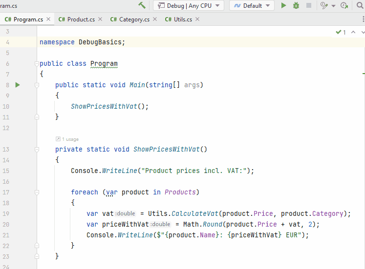

# Setting a breakpoint

Breakpoints are placed next to lines of code. When running your program in *debug mode* (shown later),
your program will pause execution at the break point, and you can inspect all kinds of information.

A breakpoint is placed in the *gutter*.

Now, suppose we don't like the numbers and want to understand how the calculations are made by debugging our program.

In our program, all calculation results are shown by the `ShowPricesWithVat` method, so, let's put a breakpoint on the first line of this method, and run the program in debug mode, like so:

Let your program be paused here, and continue to the next slide.