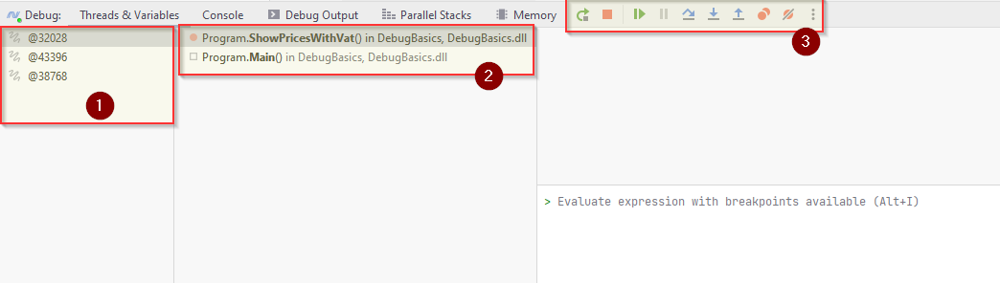

# The Debug Window
After we start debugging, the program stops at the breakpoint. To examine the state of the paused program, we use the *Debug* window.

This window contains all kinds of information:

1) Here we see the active threads. The current threads is selected `@32028`. You usually don't need to care about this part.
2) Here we see the call stack, these are the methods called in order to reach the breakpoint. On my stack there are only two methods. First `Main()` was called, and from that we called `ShowPricesWithVat()`. 
   1) You can click on the `Main()` in the stack, and the debugger will take you to that place, and show you information. You will see in the window below (3) that the `args` variable of the `Main()` method is shown. The variable is empty.
   2) Click back on `ShowPricesWithWat()` in (2)
3) These are your buttons to navigate execution of your code. We will come back to these.

