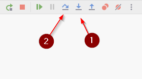

# Advancing execution
During debugging we step through the program to examine the program state at various execution points. 
There are two main ways you can step through code:
1) `Step Into` [F7]: if a line of code runs a function, you will step inside it and stop at the beginning of this function.
2) `Step Over` [F8]: if you're not interested in the function, debugger will execute the call and stop at the next statement.

We'll take a look at both.