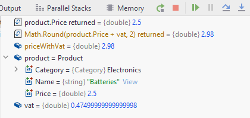
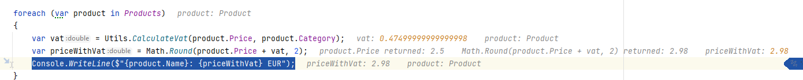

# Stepping over code
Your program should still be paused at the `Console.WriteLine()`. Otherwise stop execution, and restart with the debugging button.

Let's begin with stepping over the `Utils.CalculateVat` function in the `foreach`-loop:

Notice how the information below changes for each step, as more/different information is available.

When the program is paused again at the `Console.WriteLine()` inside the for-loop, the current information is this:

We can see that the variable `priceWithVat` has the value 2.98.

We can inspect the `product` variable, by clicking the little expand arrow, and see that:
* The `Category` of the product is `Electronics`
* The `Name` is Batteries
* The `Price` is 2.5

You should also note that values and information are shown, not only in the debugging window, but also directly in your code:

