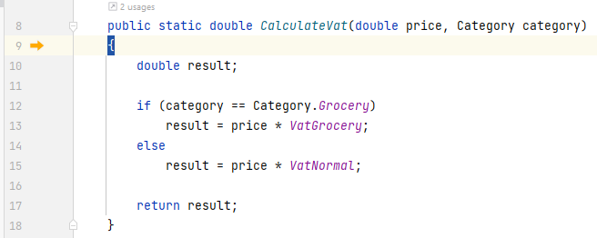

# Stepping Into Code
Press the step over button [F8] a few times, until the exeuction point reaches the line with `var vat = Utils.CalculateVat(...`

Now, we want to *step into*, which means we enter the method `CalculateVat`, and continue from there.

Press the step into button or [F7].

That should take your execution to the first line of `CalculateVat`, line 9 here:

Press the *step over* button a number of times until you exit the method again. Inspect the values in the debug window along the way.

