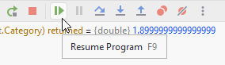

# Resuming the program

At any time, you can resume program execution. The program will run till the next breakpoint, if any. 

E.g. if you have a loop with several lines of code, and your are looking for something specific after a couple of iterations, maybe you don't want to use step-over all the way.
Put a break point at the beginning, and use *resume* to iterate through loops.

Let's create a breakpoint inside the `Utils.CalculateVat()` and check how it works:

Add a break point here in Utils.cs:

Your program should currently be paused in the for-loop in Program.cs. Press the resume-program button:

The program will resume execution and then stop at our newly created breakpoint.

