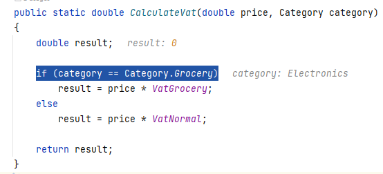
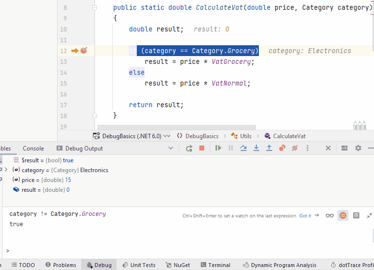

# Evaluating expressions

During debugging, you can evaluate any expression in the context of the current execution point. 
Say, we want to evaluate the insides of our `if` block:

We can select part sof the code and use the `Evaluate Expression` feature to execute that piece of code, like this:

Alternatively, you can often hold down [alt] key, and left click on expressions, methods, or other, to evaluate it.

Note that you can evaluate just about **any** arbitrary expression. The only requirement is the variables you use exist in the current context.