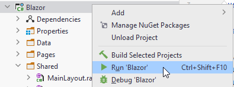
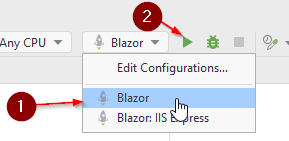

# TESTING, TESTING, 1, 2, TESTING
Let us see what the current app looks like. It is not particularly interesting, but let us just verify the Todos page is working, and you can navigate to it.

Now, in .NET6, the Program.cs no longer has an explicit main method. You are probably used to having a little green play arrow next to the main method in IntelliJ.  
We have that for explicit main methods in Rider too. But at the time of writing, not for implicit main methods.

Instead, you can right click the Blazor project folder and run the project:

Alternatively, up to the right of the editor, you can select Blazor and click the green play button:

**Never** run the "IIS Express". You will see this option for Blazor, and later for the Web API. We don't use this.

When running, the app should automatically open a new tab in your favourite browser. Alternatively, click the link in the Run console.

The app should open, you should be able to click Todos in the nav menu, and open the world's most bland page. Let's improve that.