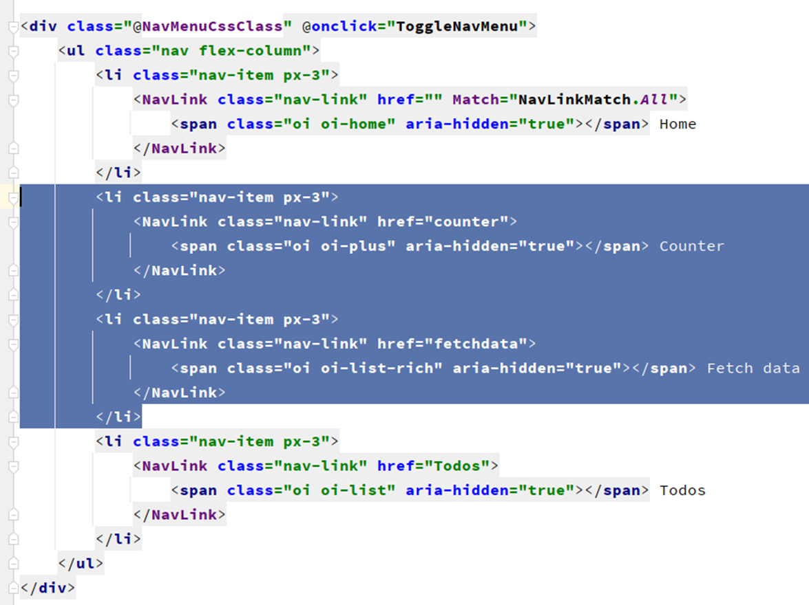
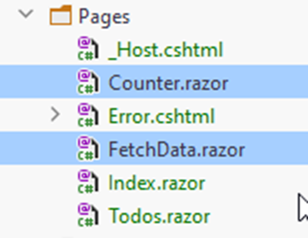
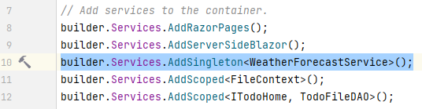
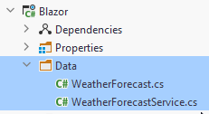

# Cleaning up

The default project comes with various classes/functionality, we don't really need. E.g. the weather data stuff and counter incrementer.
We might as well remove this, so we don't clutter our app.

### NavMenu
First, the nav menu, open that file. Remove the part highlighted below, that's the counter and weather data:

We now only have two menu items, the Todos overview and the home page, which is nice to have. We can expand on that later.

### Pages
In the pages folder, remove the highlited razor components:

### Program.cs
Open Program.cs, we wish to remove the WeatherForecastService, delete the highlighted line:

Also, at the top of the class remove the `using Blazor.Data;` statement. 

### Classes
Finally, delete the Data directory, with its content: `WeatherForecast.cs` and `WeatherForecastService.cs`.

### Test
Now it is time to confirm we didn't break anything. Run your app, verify the two nav menu items are gone, and that your Todos page still works.
