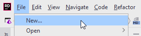

# Creating a new solution
For previous exercises, you have most likely put them all in the same solution, and created a new project for each exercise.

This tutorial will be a slightly larger exercise, perhaps sort of a mini-SEP. As such, we wish to have a better code-structure for our application. You have been taught the SOLID design principles. They usually apply to single methods, or classes. In this project we will attempt to apply *Clean Architecture*, which is basically applying the SOLID principles on a larger scale.

Therefore, we're going to need a new, **empty solution**. You can name it TodoApp.

Follow the steps below to create a new solution:

Clicking **New...** will open the dialog for creating a new solution, see below.
1) Select Empty Solution
2) Give your solution a name. I have multiple Todo apps by now, so I have called mine *BlazorTodoApp*
3) You can choose to add a git repository, if you wish.

Your new empty solution should now look like this:

I.e. it's pretty empty. Next up, we will talk about the solution structure.