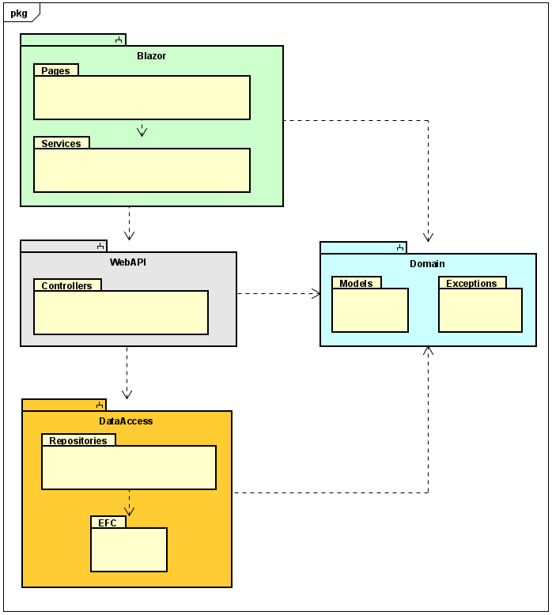

# Project structure
You have previously heard about layered systems on second semester, a simple example could look like this:

This would be a basic structure for a local desktop app. In SEP2 you expanded to a client server system, using JFX. Such a system could be diagrammed like below:

The same approach applies: Layers have different responsibilites, and each layer is separated by interfaces. In SEP2 you probably divided layers into different packages.
The next step is to separate into *modules*. In Java it's called a module, in .NET it's called a *project*. This means your .NET app will be structured using an approach like below:

This is your entire solution. You will have at least 4 projects: Blazor, WebAPI, Domain, DataAccess.  
In this first part we will start with Blazor and DataAccess.

The point is that these projects (modules) are separated, each handling their own responsibilities. There are different approaches on how to structure these modules. We will do by layer, because that is simpler. However, in your professional career, you will probably encounter a separation by feature. This is the recommended approach, however much more complicated. 

This may seem a bit overwhelming, but we will take it step by step, holding hands along the way. You will be safe.