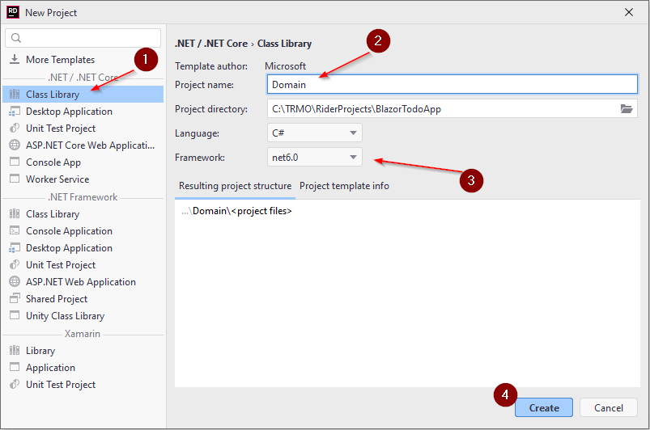

# The Domain component
First, need the model classes. In this first iteration of the tutorial, we will just need a Todo object. Later we will add Users.

### New project
Create a new Library project, by right-clicking your solution:


This will open a familiar dialog, where you can create a Class Library (1). Give the project a name (2), I have called mine *Domain*. In your case, you can probably only select net6.0 (3). Finally press Create (4).



A Class Library is a type of project which cannot be run, it instead contains functionality. All NuGet packages are generally libraries with functionality, you can import into your system. Your Domain component will just contain the domain model classes, there is nothing to *run*. If you make custom Exceptions, they could also go here.

### Model classes
Inside your Domain project, create a new directory, name it Models. In here we put the model classes.

Create a new class, call it `Todo`:


The `Todo` class needs properties for the data, a Todo should hold:

```csharp
namespace Domain.Models;

public class Todo
{
    public int Id { get; set; }
    public int OwnerId { get; set; }
    public string Title { get; set; }
    public string Description { get; set; }
    public bool IsCompleted { get; set; }

    public Todo(int ownerId, string title, string description)
    {
        OwnerId = ownerId;
        Title = title;
        Description = description;
    }
}
```

We have created a constructor, which only takes three of the five properties as arguments. The intention is that the Id should be set by whatever class persists the data, and you cannot create a Todo, which is initially already completed.