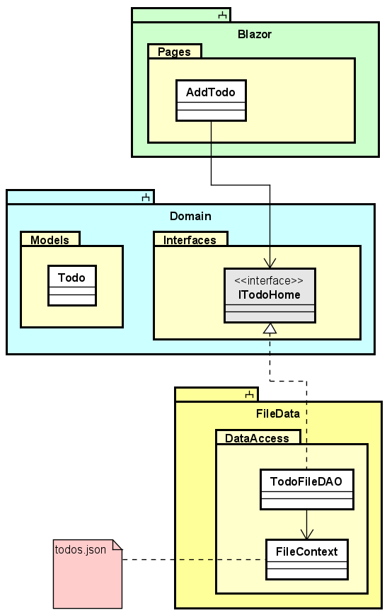

# A tale of three components
We are going to need two more components for this first part of the tutorial: 
a Blazor-server component, and another component to save data to a file. 
The relationship between the components will be like below:

Both Blazor and FileData knows about Domain, but neither knows about the other. 
Because of this separation, we can at a later point easily swap out which implementation of ITodoHome Blazor uses. Initially it will be the file storage functionality, but later it will be a client, which contacts a server.

There is a small detail that we will have to require Blazor to know about the FileData component, that cannot be avoided, but it will have a microscopic impact, and it is still very easy to remove FileData, and input something else. We'll get back to this later.
