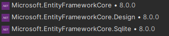

# Adding EFC Packages

In order to use EFC, we must add it to the relevant project.

The first step is therefore to add the following NuGet packages to the project, where you wish to use EFC, i.e. the project responsible for data persistence.

At the time of writing, we are using EFC8. You should use the version, which matches your .NET version.\
And you should use a stable version of EFC, i.e. no "beta"-version. These are suffixed with "RC", I think.

Add the following three packages:

1) Microsoft.EntityFrameworkCore
2) Microsoft.EntityFrameworkCore.Design
3) Microsoft.EntityFrameworkCore.Sqlite

We are going to use SQLite in the course, that is just easier.\
You may go for another relational database, if you like, but there is really no benefit, 
as we will not be doing much more than just testing out stuff. 