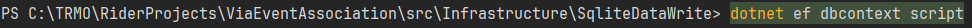

# Design Time Context Factory

[Design time](https://learn.microsoft.com/en-us/ef/core/cli/dbcontext-creation?tabs=dotnet-core-cli)
refers to the time where e.g. a migration is created.\
Here, an instance of our DbContext will be created.

We do have a problem though, because our DbContext requires an argument for its constructor.\
Usually this is provided in the Program.cs class, upon start up, so generally not a problem.\
But when just generating the database or verifying a configuration, 
or testing whether a DbContext can actually be created, or verifying the output sql looks right,
we need some way to provide this argument.

We do this with a DesignTimeContextFactory.

At the same location as your DbContext, create the following class:

```csharp
public class DesignTimeContextFactory : IDesignTimeDbContextFactory<SqliteWriteDbContext>
{
    public SqliteWriteDbContext CreateDbContext(string[] args)
    {
        var optionsBuilder = new DbContextOptionsBuilder<SqliteWriteDbContext>();
        optionsBuilder.UseSqlite(@"Data Source = VEADatabaseProduction.db");
        return new SqliteWriteDbContext(optionsBuilder.Options);
    }
}
```

Modify code as needed, e.g. if you have named your DbContext differently, you must fix the generic type argument in the inheritance in line 1.
And in the first line inside the method.\
You may also change the data source variable, if you want to call your database something else. Or if you use a different database provider, e.g. PostgreSQL.

When trying to e.g. create a migration, or verifying a configuration, EFC will look for this class, and use it to instantiate a DbContext with the correct parameters.

## Test
To test this, open the terminal, navigate into the project, and type:

```shell
dotnet ef dbcontext script
```

Like this:



We will use this command over and over, to verify our configurations.

The point of that command is to see what SQL script is generated, based on your current DbContext, if we were to create a migration, e.g. build the database.

It will fail. That's fine, this is what we currently expect.\
It should fail with an error message about one of your entities needing a primary key:

"... The exception 'The entity type 'VeaEvent' requires a primary key to be defined ..."

If you get this message, all is good for now.

#### Wrong failure
If you get a message about not being able to instantiate/activate the DbContext, you have failed incorrectly:

"Unable to resolve service for type 'Microsoft.EntityFrameworkCore.DbContextOptions' while attempting to activate 'SqliteDataWrite.SqliteWriteDbContext'"

This is because EFC cannot find your IDesignTimeDbContextFactory.