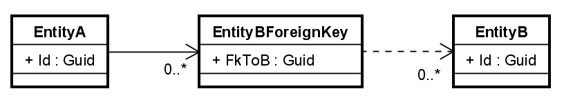

# List of Guid Foreign Keys

Sometimes an entity needs to reference multiple instances of another type of entity. 
This is a one-to-many relationship, but we change where the foreign key is. Now, we keep a list of foreign keys on the "parent"
entity, instead of a single foreign key on the "child" entity.

This is a common pattern, and it is often used when we have a "parent" entity, which has a list of "child" entities.

We do, however, encounter a problem, as this is not easily mapped. 
We therefore, unfortunately, have to make modifications to our Entities, to make this work.\
This is a bit unfortunate, because it is not a domain concern, but a persistence concern.

We can keep the changes internal, so, hopefully, it will not cause to many problems.

### Entities
First, the initial case.

We have two entities: EntityA and EntityB.\
EntityA has a list of foreign keys to EntityB.

Like this:


```csharp
public class EntityB
{
    public Guid Id { get; }

    public EntityB(Guid id)
    {
        Id = id;
    }
}

public class EntityA
{
    public Guid Id { get; }

    internal List<Guid> foreignKeysToB = new();

    public EntityA(Guid id)
    {
        Id = id;
    }

    public void AddForeignKey(Guid fk) => foreignKeysToB.Add(fk);
}
```

You can see that EntityA has a list of foreign keys, and EntityB has a single Guid as primary key.

### Configuration
How do we configure this? A list of simple type is not easy to store in the database, in a meaningful way. 
Some suggestions will json-fy this, and just store a string. 
But that won't work for us. It would ruin the referential integrity.

The database is going to need a "join-table", with two attributes, 
one referencing the EntityA (back to owner), and another referencing EntityB. 
This is the actual foreign key from the EntityA class.

I have not found a simple solution to this, and essentially, it we cannot map a list of Guids. 
We need to create a wrapper class, which contains the Guid. 
This problem is then a list of entities, with some referential integrity details, 
which is simple enough handle. One entity having a list of other entities is an often use case.

We must therefore first modify EntityA, to instead contain a list of EntityBForeignKey instances.

The wrapper can be made simple, like this:
```csharp
public class EntityBForeignKey(Guid id)
{
    public Guid Id { get; } = id;
}
```
We ca use the [primary constructor](https://learn.microsoft.com/en-us/dotnet/csharp/whats-new/tutorials/primary-constructors) approach, to make it even more concise.
Or create an explicit constructor.

We will also have to rework EntityA, to use this wrapper class. To minimize changes, 
I suggest adding an implicit operator to EntityBForeignKey, so that we can easily convert a Guid into the wrapper.\
And then another, so we can easily unwrap an EntityBForeignKey into a Guid.


Now the EntityBForeignKey class looks like this:

```csharp
public class EntityBForeignKey(Guid id)
{
    public Guid Id { get; } = id;

    public static implicit operator EntityBForeignKey(Guid id) 
        => new (id);
    
    public static implicit operator Guid(EntityBForeignKey ent)
        => ent.Id;
}
```
(Maybe "FkToB" is a better name, but I don't want to change the guide and code)

And EntityA looks like this:

```csharp
public class EntityA
{
    public Guid Id { get; }

    internal List<EntityBForeignKey> foreignKeys = new();

    public EntityA(Guid id)
    {
        Id = id;
    }

    public void AddForeignKey(Guid fk) => foreignKeys.Add(fk);
}
```

Notice the list now contains instances of EntityBForeignKey, _however_ we have not modified the `AddForeignKey()` method, because of the implicit operators.

If we need the Guids for some logic, we can (mostly) just use the wrappers as if they were Guids, because of the implicit operators.

Now, the diagram looks like this:




Now, EntityBForeignKey is a separate, join table, used to bind EntityA and EntityB together.

It will become a separate table in the database, like this:


The configuration is a bit more involved this time around. Here we go:

```csharp
private void ConfigureListOfGuidsAsForeignKeys(ModelBuilder mBuilder)
{
    mBuilder.Entity<EntityA>().HasKey("Id");
    mBuilder.Entity<EntityB>().HasKey("Id");

    mBuilder.Entity<EntityBForeignKey>().Property<Guid>("FkToA");
    mBuilder.Entity<EntityBForeignKey>().HasKey("FkToA", "FkToB");

    mBuilder.Entity<EntityA>()
        .HasMany<EntityBForeignKey>("foreignKeysToB")
        .WithOne()
        .HasForeignKey("FkToA")
        .OnDelete(DeleteBehavior.Cascade);

    mBuilder.Entity<EntityBForeignKey>()
        .HasOne<EntityB>()
        .WithMany()
        .HasForeignKey(x => x.FkToB);
}
```

Lines 3,4: Configure the primary keys for EntityA and EntityB.

Line 6: EntityBForeignKey will become a new separate table, and we need a foreign key back to the owner, EntityA.\
There is currently no attribute, so we say EntityBForeignKey has a shadow property, called `FkToA`.\

Line 7: Now EntityBForeignKey has two properties: FkToA, and FkToB.\
We configure the primary key for EntityBForeignKey, which is a combination of FkToA and FkToB. I.e. a composite key.

Line 9: We start configuring EntityA.\
Line 10: We say that EntityA has many EntityBForeignKey instances.\
Line 11: We say that each EntityBForeignKey has one EntityA.\
Line 12: We say that the foreign key on EntityBForeignKey, which points back to EntityA, is called `FkToA`.\
Line 13: We say that if an EntityA is deleted, all the EntityBForeignKey instances pointing to it, should also be deleted. This is a cascade delete.

Line 15: We start configuring EntityBForeignKey.\
Line 16: We say that EntityBForeignKey has one EntityB.\
Line 17: We say that EntityB has many EntityBForeignKey instances (though not present in the code).\
Line 18: We say that the foreign key on EntityBForeignKey, which points to EntityB, is the `FkToB` property.

Now, we could also add the `OnDelete` method to the EntityBForeignKey configuration, to make sure that if an EntityB is deleted, the EntityBForeignKey is also deleted.\
There are probably cases, where this makes sense.\
But there may also be cases, where we want to keep the EntityBForeignKey, even if the EntityB is deleted.\
Maybe you want to handle this in business logic instead.\
Even though in the database EntityBForeignKey references both A and B, we know that in the domain model, it is A, which owns the EntityBForeignKey. 
Therefore, you might argue that changes to/deletion of EntityB instances, should not affect the integrity of EntityA.

The script generated looks like this:

```sql
CREATE TABLE "EntityAs" (
    "Id" TEXT NOT NULL CONSTRAINT "PK_EntityAs" PRIMARY KEY
);

CREATE TABLE "EntityBs" (
    "Id" TEXT NOT NULL CONSTRAINT "PK_EntityBs" PRIMARY KEY
);

CREATE TABLE "EntityBForeignKey" (
    "FkToB" TEXT NOT NULL,
    "FkToA" TEXT NOT NULL,
    CONSTRAINT "PK_EntityBForeignKey" PRIMARY KEY ("FkToA", "FkToB"),
    CONSTRAINT "FK_EntityBForeignKey_EntityAs_FkToA" FOREIGN KEY ("FkToA") REFERENCES "EntityAs" ("Id") ON DELETE CASCADE,
    CONSTRAINT "FK_EntityBForeignKey_EntityBs_FkToB" FOREIGN KEY ("FkToB") REFERENCES "EntityBs" ("Id") ON DELETE CASCADE
);

```
The interesting part is the join table. You will notice the two attributes, and the composite primary key as well.

Then two foreign keys. And we do actually get an `ON DELETE CASCADE` for both foreign keys. 
It seem EFC configures this, because the Guid of EntityForeignKey class is non-nullable. 
Interesting. We could _probably_ override this with:

```csharp
.OnDelete(DeleteBehavior.SetNull);
```

### Test
We need two tests, a success to see that we can save and retrieve the foreign keys. 
And failure to show that we cannot reference a non-existing EntityB.

```csharp
[Fact]
public async Task ListOfGuidFkReferences_ValidValues()
{
    await using MyDbContext ctx = SetupContext();

    // adding reference entities
    EntityB b1 = new(Guid.NewGuid());
    EntityB b2 = new(Guid.NewGuid());
    EntityB b3 = new(Guid.NewGuid());

    ctx.EntityBs.AddRange(b1, b2, b3);
    await ctx.SaveChangesAsync();
    ctx.ChangeTracker.Clear();


    EntityA a1 = new(Guid.NewGuid());
    a1.AddForeignKey(b1.Id);
    a1.AddForeignKey(b2.Id);
    a1.AddForeignKey(b3.Id);

    await SaveAndClearAsync(a1, ctx);


    EntityA retrieved = ctx.EntityAs
        .Include("foreignKeysToB") // I have to include, because this was not done with Owned Entity Types.
        .Single(x => x.Id == a1.Id);

    Assert.NotEmpty(retrieved.foreignKeysToB);
    Assert.Contains(retrieved.foreignKeysToB, x => x.FkToB == b1.Id);
    Assert.Contains(retrieved.foreignKeysToB, x => x.FkToB == b2.Id);
    Assert.Contains(retrieved.foreignKeysToB, x => x.FkToB == b3.Id);
}
``` 
* Get context
* Create and save 3 EntityB instances.
* Clear cache.
* Then we retrieve the EntityA again, and notice the `Include(..)`, because we need to load associated _entities_, not owned values. We use a string to reference the navigation property.
* Then we assert that the foreign keys are there.
* And we assert the foreign keys match the IDs of the EntityB instances.

Here's the failure case:

```csharp
[Fact]
public async Task ListOfGuidFkReferences_InvalidValues()
{
    await using MyDbContext ctx = SetupContext();
    EntityA a1 = new(Guid.NewGuid());
    a1.AddForeignKey(Guid.NewGuid());
    a1.AddForeignKey((Guid.NewGuid()));
    a1.AddForeignKey((Guid.NewGuid()));

    ctx.EntityAs.Add(a1);
    
    Action exp = () => ctx.SaveChanges();

    Exception? exception = Record.Exception(exp);
    Assert.NotNull(exception);
}
```

* Create an EntityA, and add 3 foreign keys, which are not associated with any EntityB.
* Assert that we get an exception, when trying to save the changes.