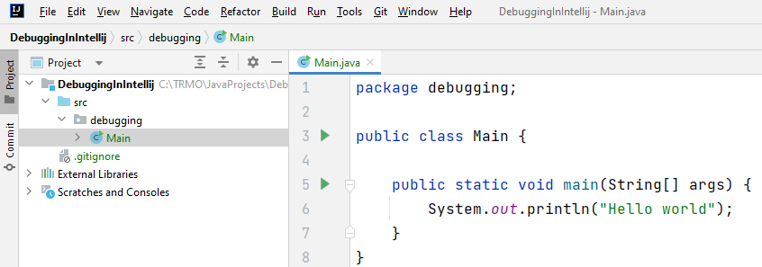

# New Project

First, you will need a new Java project. Or a folder in an existing, it's not all that important.\
I assume you create a new project, set it up as usual, have a package with a class, containing a main method.

For example like this:

Notice project structure on the left, and the initial code on the right.

You should be able to run the main method, and get a print out. Just to make sure things are set up correctly.